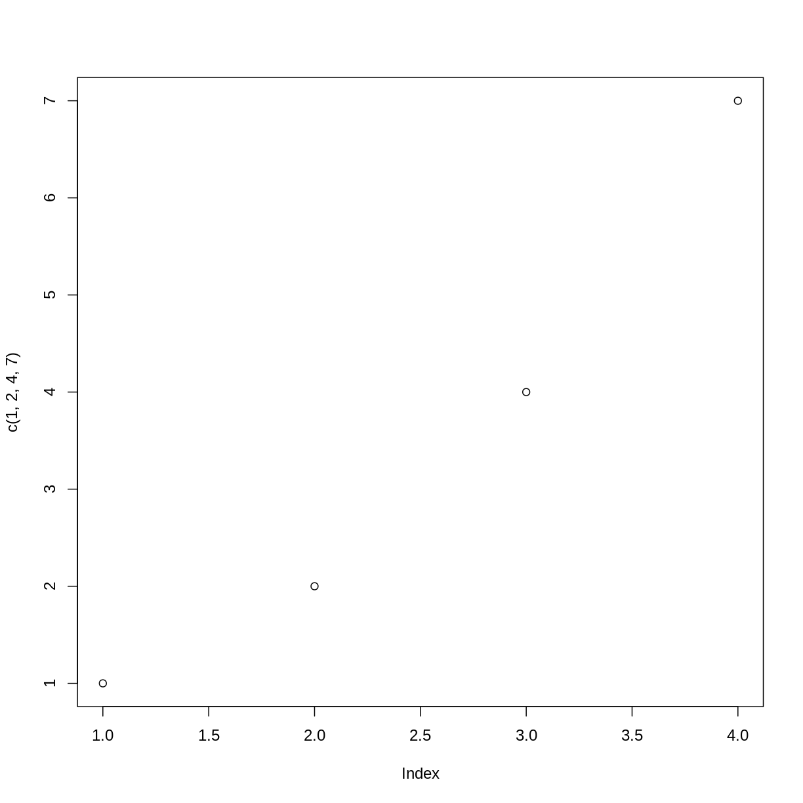

---
# Please do not edit this file directly; it is auto generated.
# Instead, please edit 01-Intro.md in _episodes_rmd/
source: Rmd
title: "Some Machine Learning Tools for Tabular Data"
teaching: 10
exercises: 2
questions:
- "What is machine learning?"
- "What specific tools will this lesson cover?"
objectives:
- "Give an overview of machine learning."
- "Distinguish between classifiers and regression models."
- "Describe the specific methods that this lesson will focus on."
keypoints:
- "There are many types of machine learning."
- "We will focus on some methods that work well with tabular data."
---

## What is Machine Learning?

## Classification vs. Regression

~~~
plot(c(1,2,4,7))
~~~
{: .language-r}

## Our Focus

~~~
2 + 3
~~~
{: .language-r}

~~~
[1] 5
~~~
{: .output}
