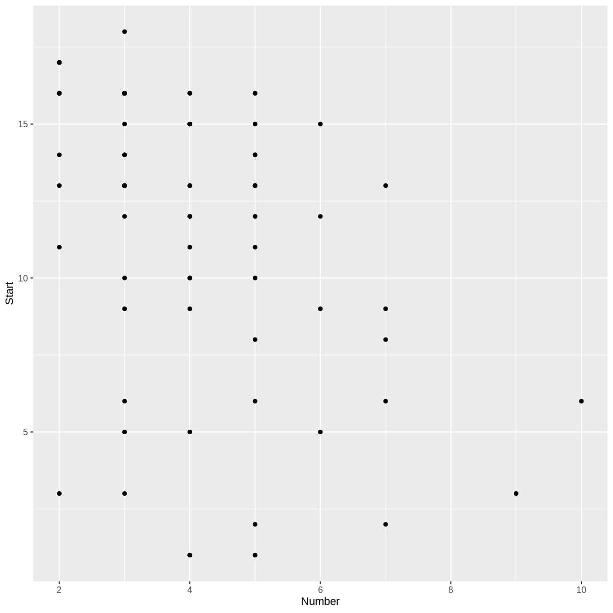

---
# Please do not edit this file directly; it is auto generated.
# Instead, please edit 02-Linear-Logistic.md in _episodes_rmd/
source: Rmd
title: "Linear and Logistic Regression"
teaching: 50
exercises: 15
questions:
- "How can a model make predictions?"
- "How do we judge the accuracy of predictions?"
objectives:
- "Define a linear regression model."
- "Define a logistic regression model."
- "Split data into training and testing sets."
keypoints:
- "Regression models can make predictions."
- "Testing sets can be used to measure the accuracy of a model."
---

## Kyphosis Data

~~~
library(rpart)
str(kyphosis)
~~~
{: .language-r}

~~~
'data.frame':	81 obs. of  4 variables:
 $ Kyphosis: Factor w/ 2 levels "absent","present": 1 1 2 1 1 1 1 1 1 2 ...
 $ Age     : int  71 158 128 2 1 1 61 37 113 59 ...
 $ Number  : int  3 3 4 5 4 2 2 3 2 6 ...
 $ Start   : int  5 14 5 1 15 16 17 16 16 12 ...
~~~
{: .output}

For a description of this data set, you can view the help menu for `kyphosis`.

~~~
?kyphosis
~~~
{: .language-r}

~~~
library(tidyverse)
ggplot(kyphosis, aes(x = Number, y = Start)) + geom_point()
~~~
{: .language-r}

> ## Challenge: Number and Start
>
> Do you notice a trend in the above scatterplot? In the context of
> the `kyphosis` data, why would there be such a trend?
>
> > ## Solution
> > 
> > There appears to be a weak, negative association between
> > `Number` and `Start`: larger values of `Number` correspond
> > to smaller values of `Start`. This correspondence makes sense,
> > because if more vertebrae are involved, the topmost vertebra would
> > have to be higher up. (The vertebrae are numbered starting from
> > the top.)
> > 
> {: .solution}
{: .challenge}

## Make a training set and a test set

~~~
trainSize <- round(0.75 * nrow(kyphosis))
set.seed(6789) # so we all get the same random sets
trainIndex <- sample(nrow(kyphosis), trainSize)
trainDF <- kyphosis[trainIndex, ]
testDF <- kyphosis[-trainIndex, ]
~~~
{: .language-r}

## Linear Regression

~~~
model1 <- lm(Start ~ Number, data = trainDF)
summary(model1)
~~~
{: .language-r}

~~~

Call:
lm(formula = Start ~ Number, data = trainDF)

Residuals:
    Min      1Q  Median      3Q     Max 
-11.018  -1.610   1.615   3.186   5.798 

Coefficients:
            Estimate Std. Error t value Pr(>|t|)    
(Intercept)  16.4268     1.6393  10.021 2.38e-14 ***
Number       -1.2041     0.3721  -3.236  0.00199 ** 
---
Signif. codes:  0 '***' 0.001 '**' 0.01 '*' 0.05 '.' 0.1 ' ' 1

Residual standard error: 4.698 on 59 degrees of freedom
Multiple R-squared:  0.1507,	Adjusted R-squared:  0.1364 
F-statistic: 10.47 on 1 and 59 DF,  p-value: 0.001988
~~~
{: .output}

The predicted `Start` is obtained by multiplying `Number` by -1.204 and adding 16.427.

> ## Challenge: Make a prediction
>
> Predict the number of the topmost vertebra when the number of
> vertebrae involved is 6.
>
> > ## Solution
> > 
> > Six times -1.204 plus 
> > 16.427 
> > is approximately 
> > 9.2.
> > 
> {: .solution}
{: .challenge}

## Try the Testing Data Set

How well will our model perform on data that it was not trained on?

~~~
predictedStart <- predict(model1, testDF)
actualStart <- testDF$Start
errors <- predictedStart - actualStart
cat(round(errors, 1))
~~~
{: .language-r}

~~~
-3.2 -2 3 -3.2 3.8 4.4 0.2 2.6 10.6 2.8 -3.4 0.4 -3 -0.2 -0.2 1.6 -1.4 0.6 -5.6 -3.4
~~~
{: .output}

TODO: Explain RMSE

~~~
sqrt(mean(errors^2))
~~~
{: .language-r}

~~~
[1] 3.625151
~~~
{: .output}

> ## Challenge: Mean Absolute Error
>
> The *Mean Absolute Error* (MAE) is the average of the absolute values of the
> errors.  Compute the MAE for the above example.
>
> > ## Solution
> > 
> > 
> > ~~~
> > mean(abs(errors))
> > ~~~
> > {: .language-r}
> > 
> > 
> > 
> > ~~~
> > [1] 2.77752
> > ~~~
> > {: .output}
> > 
> {: .solution}
{: .challenge}

## Logistic Regression

TODO: Density plots

TODO: Logistic model

~~~
model2 <- glm(Kyphosis ~ Age + Number + Start, data = trainDF, family = "binomial")
~~~
{: .language-r}

Shorthand notation:

~~~
model2 <- glm(Kyphosis ~ ., data = trainDF, family = "binomial")
~~~
{: .language-r}

~~~
predict(model2, testDF, type = "response")
~~~
{: .language-r}

~~~
         12          21          32          36          37          38 
0.060991556 0.004837329 0.066676823 0.027771160 0.034862103 0.389677526 
         39          43          44          46          47          51 
0.287882930 0.988363673 0.531083119 0.183999574 0.122064478 0.244337950 
         52          57          60          66          68          69 
0.003170923 0.014410381 0.061131542 0.069057143 0.236889844 0.056456800 
         70          76 
0.035581184 0.206575349 
~~~
{: .output}

~~~
levels(kyphosis$Kyphosis)
~~~
{: .language-r}

~~~
[1] "absent"  "present"
~~~
{: .output}

~~~
predictedKyphosis <- ifelse(predict(model2, testDF, type = "response") < 0.5,
                            "absent", "present")
predictedKyphosis
~~~
{: .language-r}

~~~
       12        21        32        36        37        38        39        43 
 "absent"  "absent"  "absent"  "absent"  "absent"  "absent"  "absent" "present" 
       44        46        47        51        52        57        60        66 
"present"  "absent"  "absent"  "absent"  "absent"  "absent"  "absent"  "absent" 
       68        69        70        76 
 "absent"  "absent"  "absent"  "absent" 
~~~
{: .output}

TODO: accuracy measurement

~~~
testDF$Kyphosis == predictedKyphosis
~~~
{: .language-r}

~~~
   12    21    32    36    37    38    39    43    44    46    47    51    52 
 TRUE  TRUE  TRUE  TRUE  TRUE FALSE  TRUE FALSE FALSE FALSE  TRUE  TRUE  TRUE 
   57    60    66    68    69    70    76 
 TRUE  TRUE  TRUE  TRUE  TRUE  TRUE  TRUE 
~~~
{: .output}

~~~
accuracy <- sum(testDF$Kyphosis == predictedKyphosis)/nrow(testDF)
cat("Proportion of correct predictions: ", accuracy, "\n")
~~~
{: .language-r}

~~~
Proportion of correct predictions:  0.8 
~~~
{: .output}

TODO: Challenge: Try a different random seed. Does the accuracy stay the same?

TODO: Challenge: Try using multinom from nnet package.
