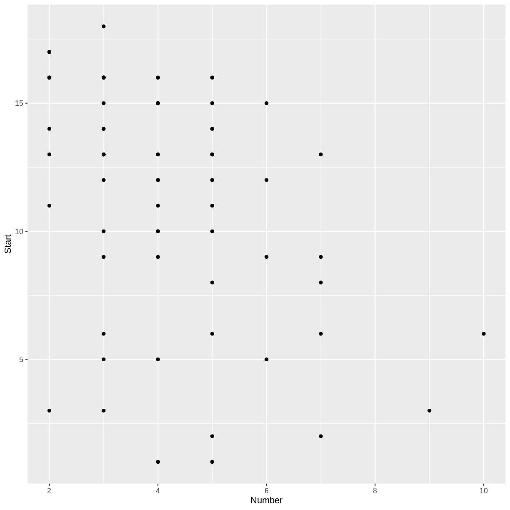

---
# Please do not edit this file directly; it is auto generated.
# Instead, please edit 02-Linear-Logistic.md in _episodes_rmd/
source: Rmd
title: "Linear and Logistic Regression"
teaching: 50
exercises: 15
questions:
- "How can a model make predictions?"
- "How do we judge the accuracy of predictions?"
objectives:
- "Define a linear regression model."
- "Define a logistic regression model."
- "Split data into training and testing sets."
keypoints:
- "Regression models can make predictions."
- "Testing sets can be used to measure the accuracy of a model."
---

## Kyphosis Data

~~~
library(rpart)
str(kyphosis)
~~~
{: .language-r}

~~~
'data.frame':	81 obs. of  4 variables:
 $ Kyphosis: Factor w/ 2 levels "absent","present": 1 1 2 1 1 1 1 1 1 2 ...
 $ Age     : int  71 158 128 2 1 1 61 37 113 59 ...
 $ Number  : int  3 3 4 5 4 2 2 3 2 6 ...
 $ Start   : int  5 14 5 1 15 16 17 16 16 12 ...
~~~
{: .output}

For a description of this data set, you can view the help menu for `kyphosis`.

~~~
?kyphosis
~~~
{: .language-r}

~~~
library(tidyverse)
ggplot(kyphosis, aes(x = Number, y = Start)) + geom_point()
~~~
{: .language-r}

> ## Challenge: Number and Start
>
> Do you notice a trend in the above scatterplot? In the context of
> the `kyphosis` data, why would there be such a trend?
>
> > ## Solution
> > 
> > There appears to be a weak, negative association between
> > `Number` and `Start`: larger values of `Number` correspond
> > to smaller values of `Start`. This correspondence makes sense,
> > because if more vertebrae are involved, the topmost vertebra would
> > have to be higher up. (The vertebrae are numbered starting from
> > the top.)
> > 
> {: .solution}
{: .challenge}

## Make a training set and a test set

~~~
trainSize <- round(0.75 * nrow(kyphosis))
set.seed(1234) # so we all get the same random sets
trainIndex <- sample(nrow(kyphosis), trainSize)
trainDF <- kyphosis[trainIndex, ]
testDF <- kyphosis[-trainIndex, ]
~~~
{: .language-r}

## Linear Regression

~~~
model1 <- lm(Start ~ Number, data = trainDF)
summary(model1)
~~~
{: .language-r}

~~~

Call:
lm(formula = Start ~ Number, data = trainDF)

Residuals:
     Min       1Q   Median       3Q      Max 
-10.6958  -1.6958   0.9429   2.6235   6.6655 

Coefficients:
            Estimate Std. Error t value Pr(>|t|)    
(Intercept)   18.418      1.629   11.31  < 2e-16 ***
Number        -1.681      0.371   -4.53 2.93e-05 ***
---
Signif. codes:  0 '***' 0.001 '**' 0.01 '*' 0.05 '.' 0.1 ' ' 1

Residual standard error: 4.31 on 59 degrees of freedom
Multiple R-squared:  0.258,	Adjusted R-squared:  0.2455 
F-statistic: 20.52 on 1 and 59 DF,  p-value: 2.928e-05
~~~
{: .output}

The predicted `Start` is obtained by multiplying `Number` by -1.6806365 and adding 18.4183673.

> ## Challenge: Make a prediction
>
> Predict the number of the topmost vertebra when the number of
> vertebrae involved is 6.
>
> > ## Solution
> > 
> > Six times -1.6806365 plus 18.4183673 
> > equals 8.3345481.
> > 
> {: .solution}
{: .challenge}

## Try the Testing Data Set

How well will our model perform on data that it was not trained on?

~~~
predictedStart <- predict(model1, testDF)
actualStart <- testDF$Start
errors <- predictedStart - actualStart
cat(round(errors, 1))
~~~
{: .language-r}

~~~
8.4 -1.9 -4 -2.6 -3 12.1 7.4 -0.9 -1 4.4 -2.6 10.4 1.1 -4.4 -3.3 -2.3 -1.9 -1.3 -0.3 -4.3
~~~
{: .output}

## Logistic Regression

TODO: Density plots

TODO: Logistic model

TODO: accuracy measurement

