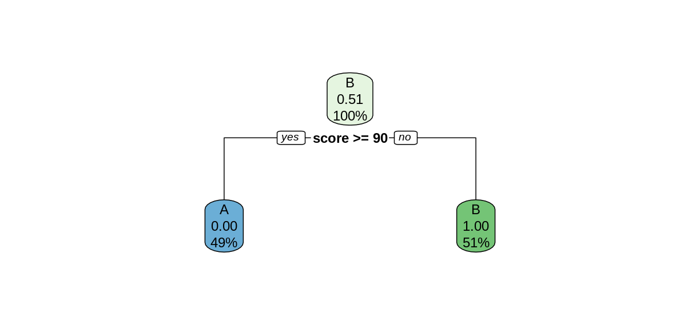
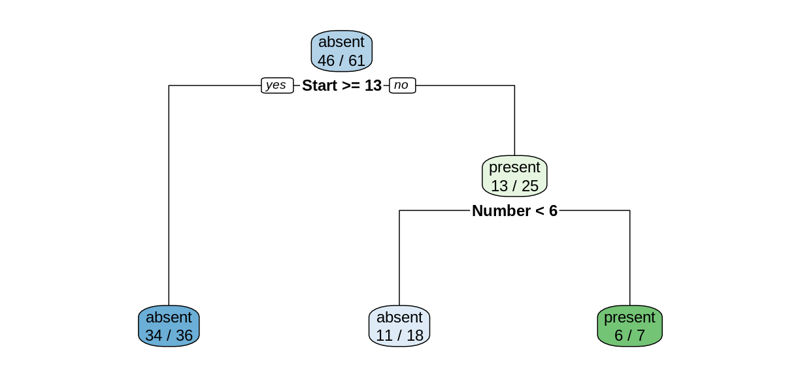

---
# Please do not edit this file directly; it is auto generated.
# Instead, please edit 03-Decision-Trees.md in _episodes_rmd/
source: Rmd
title: "Decision Trees"
teaching: 40 
exercises: 15
questions:
- "What are decision trees?"
- "How can we use a decision tree model to make a prediction?"
- "What are some shortcomings of decision tree models?"
objectives:
- "Introduce decision trees and recursive partitioning."
- "Revisit the Kyphosis example using a classification tree."
- "Illustrate the use of training and testing sets."
keypoints:
- "Training data can give us a decision tree model."
- "Decision trees can be used for supervised learning, but they are not very robust."
---

## Decision Trees

Let's simulate a data set of exam scores, along with letter grades.

~~~
library(tidyverse)
set.seed(456)
exam <- tibble(score = sample(80:100, 200, replace = TRUE)) %>%
  mutate(grade = as_factor(ifelse(score < 90, "B", "A")))
head(exam)
summary(exam)
~~~
{: .language-r}

Given only this data frame, can we recover the grading scale that was used to assign the letter grades? In other words, can we *partition* this data set into A's and B's, based on the exam score? The `rpart` command can form this partition for us, using the formula syntax we saw in the last episode.

~~~
library(rpart)
library(rpart.plot)
examTree <- rpart(grade ~ score, data = exam)
rpart.plot(examTree)
~~~
{: .language-r}

The `rpart` function searches for the best way to split the data set into predicted values of the response variables, based on the explanatory variables. This [Introduction to Rpart](https://cran.r-project.org/web/packages/rpart/vignettes/longintro.pdf) has details on how the split is chosen. In this simple case, the `rpart` function was able to perfectly partition the data after only one split. We can tell `rpart.plot` to report the number of correctly-classified cases in each node by including the option `extra = 2`.

~~~
rpart.plot(examTree, extra = 2)
~~~
{: .language-r}

Notice that in the top node, every case was classified as a B, so only the Bs were correctly classified. After the split, both child nodes were classified perfectly.

In more complex situations, the algorithm will continue to create further splits to improve its classification. This process is called *recursive* partitioning.

> ## Challenge: Use `rpart` on the `kyphosis` data
>
> Use the `rpart` function to create a decision tree using the `kyphosis` data
> set. As in the previous episode, the response variable is `Kyphosis`, and the
> explanatory varables are the remaining columns `Age`, `Number`, and `Start`. 
> 1. Use `rpart.plot` to plot your tree model. 
> 2. Use this tree to predict the value of `Kyphosis` when `Start` is 12, 
>    `Age` is 59, and `Number` is 6.
> 3. How many of the 81 cases in the data set does this tree classify incorrectly?
>
> > ## Solution
> > 
> > 
> > ~~~
> > ktree <- rpart(Kyphosis ~ ., data = kyphosis)
> > rpart.plot(ktree, extra = 2)
> > ~~~
> > {: .language-r}
> > 
> > 
> > 
> > To make a prediction using this tree, start at the top node. Since `Start` is 12,
> > and 12 >= 9, we follow the left (yes) edge. Since `Start` is not >= 15, we then 
> > follow the right (no) edge. Since `Age` is 59 and 59 is not < 55, we follow the 
> > right edge. Finally, since `Age` is not >= 111 we follow the right edge to the 
> > leaf and obtain the prediction `present`.
> > 
> > In the two leftmost leaves, all of the cases are classified correctly. However,
> > in the three remaining leaves, there are 2, 3, and 8 incorrectly classified
> > cases, for a total of 13 misclassifications.
> > 
> {: .solution}
{: .challenge}

## Using Decision Trees for Supervised Learning

In order to compare the decision tree model to the logistic regression model in the previous episode, let's train the model on the training set and test in on the testing set. The following commands will form our training and testing set using the `slice` function, which is part of the tidyverse.

~~~
trainSize <- round(0.75 * nrow(kyphosis))
set.seed(6789) # same seed as in the last episode
trainIndex <- sample(nrow(kyphosis), trainSize)
trainDF <- kyphosis %>% slice(trainIndex)
testDF <- kyphosis %>% slice(-trainIndex)
~~~
{: .language-r}

Now train the decision tree model on the training set

~~~
treeModel <- rpart(Kyphosis ~ Age + Number + Start, data = trainDF)
rpart.plot(treeModel, extra = 2)
~~~
{: .language-r}

Notice that we obtain a simpler tree using the training set instead of the full data set.

> ## Challenge: Training set accuracy
>
> What proportion of cases in the training set were classified correctly?
>
> > ## Solution
> > 
> > Reading the leaves from left to right, there were 34, 11, and 6 
> > correctly-classified cases:
> > 
> > 
> > ~~~
> > (34+11+6)/nrow(trainDF)
> > ~~~
> > {: .language-r}
> > 
> > 
> > 
> > ~~~
> > [1] 0.8360656
> > ~~~
> > {: .output}
> > 
> {: .solution}
{: .challenge}

## Model predictions on the testing set

The `predict` function works on `rpart` models similarly to how it works on `lm` and `glm` models, but the output is a matrix of predicted probabilities.

~~~
predict(treeModel, testDF)
~~~
{: .language-r}

~~~
      absent    present
1  0.9444444 0.05555556
2  0.9444444 0.05555556
3  0.6111111 0.38888889
4  0.9444444 0.05555556
5  0.6111111 0.38888889
6  0.6111111 0.38888889
7  0.1428571 0.85714286
8  0.1428571 0.85714286
9  0.6111111 0.38888889
10 0.6111111 0.38888889
11 0.9444444 0.05555556
12 0.6111111 0.38888889
13 0.9444444 0.05555556
14 0.9444444 0.05555556
15 0.9444444 0.05555556
16 0.6111111 0.38888889
17 0.9444444 0.05555556
18 0.6111111 0.38888889
19 0.9444444 0.05555556
20 0.9444444 0.05555556
~~~
{: .output}

To investigate the behavior of this model, we bind the columns of the predicted probabilities to the testing set data frame to create a new data frame called `predDF`.

~~~
predMatrix <- predict(treeModel, testDF)
predDF <- testDF %>% 
  bind_cols(predMatrix)
~~~
{: .language-r}

> ## Challenge: Predicted probabilities
>
> Compare the results in the `predDF` data frame with the plot
> of `treeModel`. Can you explain how the model is calculating the 
> predicted probabilites?
>
> > ## Solution
> > 
> > Consider the first row of `predDF`. 
> > 
> > 
> > ~~~
> > predDF[1,]
> > ~~~
> > {: .language-r}
> > 
> > 
> > 
> > ~~~
> >   Kyphosis Age Number Start    absent    present
> > 1   absent 148      3    16 0.9444444 0.05555556
> > ~~~
> > {: .output}
> > 
> > Since the value of `Start` is greater than 13, we follow the "yes" branch
> > of the decision tree and land at the leftmost leaf, labeled "absent", with 
> > a probability of 34/36, which is approximately 0.9444. Similarly, consider row 8.
> > 
> > 
> > ~~~
> > predDF[8,]
> > ~~~
> > {: .language-r}
> > 
> > 
> > 
> > ~~~
> >   Kyphosis Age Number Start    absent   present
> > 8   absent 143      9     3 0.1428571 0.8571429
> > ~~~
> > {: .output}
> > 
> > Since the value of `Start` is less than 13, we follow the "no" branch. Then since
> > the value of `Number` is greater than 6, we follow the right branch to land on the 
> > leaf labeled "present", with a probability of 6/7, which is 0.8571.
> > 
> {: .solution}
{: .challenge}

## Testing set accuracy

Let's add a new column called `Prediction` to the `predDF` data frame that gives the model prediction (`absent` or `present`) for each row, based on the probability in the `absent` column of `predDF`.

~~~
predDF <- predDF %>%
  mutate(Prediction = ifelse(predDF$absent > 0.5, "absent", "present"))
~~~
{: .language-r}

Recall that in supervised learning, we use the *testing set* to measure how our model performs on data it was not trained on. Since this model is a classification model, we compute `accuracy` as the proportion of correct predictions.

~~~
accuracy <- sum(predDF$Kyphosis == predDF$Prediction)/nrow(predDF)
cat("Proportion of correct predictions: ", accuracy, "\n")
~~~
{: .language-r}

~~~
Proportion of correct predictions:  0.8 
~~~
{: .output}

In general, the accuracy on the testing set will be less than the accuracy on the training set.

> ## Challenge: Change the training set
>
> Repeat the construction of the decision tree model for the `kyphosis`
> data, but experiment with different values of the random seed to obtain
> different testing and training sets. Does the shape of the tree change?
> Does the testing set accuracy change?
>
> > ## Solution
> > 
> > 
> > ~~~
> > set.seed(314159) # try a different seed
> > trainIndex <- sample(nrow(kyphosis), trainSize) # use the same size training set
> > trainDF <- kyphosis %>% slice(trainIndex)
> > testDF <- kyphosis %>% slice(-trainIndex)
> > treeModel <- rpart(Kyphosis ~ Age + Number + Start, data = trainDF)
> > rpart.plot(treeModel, extra = 2)
> > ~~~
> > {: .language-r}
> > 
> > 
> > 
> > Changing the seed for the train/test split resulted in a different 
> > decision tree.
> > 
> > 
> > ~~~
> > predMatrix <- predict(treeModel, testDF)
> > predictedKyphosis <- ifelse(predMatrix[,1] > 0.5, "absent", "present")
> > accuracy <- sum(testDF$Kyphosis == predictedKyphosis)/nrow(testDF)
> > cat("Proportion of correct predictions: ", accuracy, "\n")
> > ~~~
> > {: .language-r}
> > 
> > 
> > 
> > ~~~
> > Proportion of correct predictions:  0.85 
> > ~~~
> > {: .output}
> >
> > The testing set accuracy also changed.
> > 
> {: .solution}
{: .challenge}

## Robustness, or lack thereof

In this episode we have seen that the structure of the decision tree can vary quite a bit when we make small changes to the training data. Training the model on the whole data set resulted in a very different tree than what we obtained by training on a slightly smaller testing set. And changing the choice of testing set, even while maintaining its size, also altered the tree structure. When the structure of a model changes significantly for a small change in the training data, we say that the model is not *robust*. Non-robustness can be a problem, because one or two unusual observations can make a big difference in the conclusions we draw. 

Since their predictions can vary wildly depending on the randomly selected training set, decision trees are called *weak learners*. In the upcoming episodes, we will explore two methods that use *ensembles* of weak learners to create a models with more predictive strength. 

