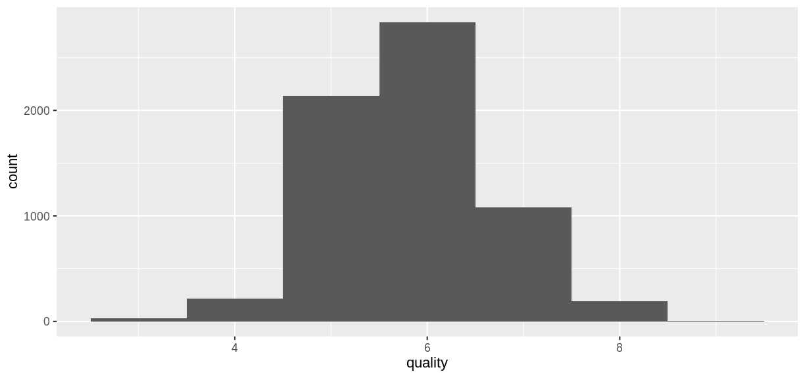
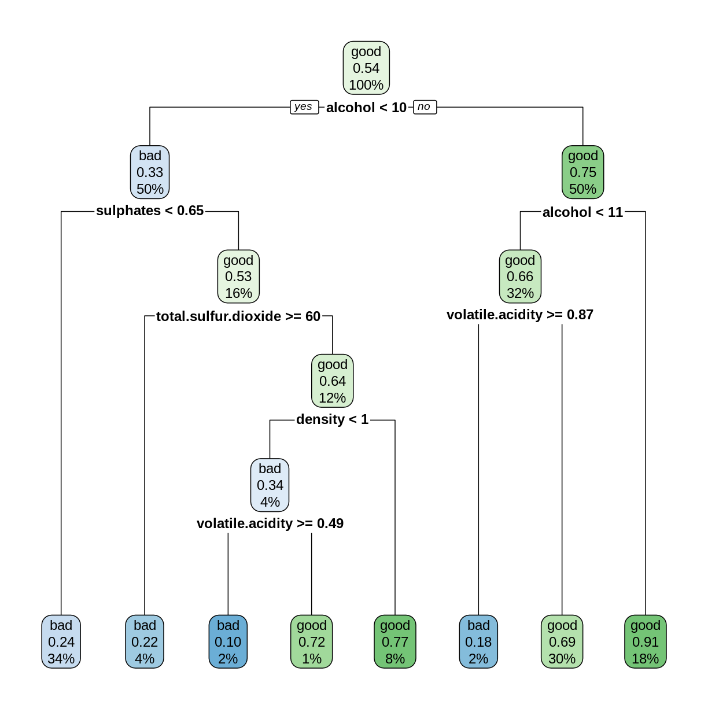
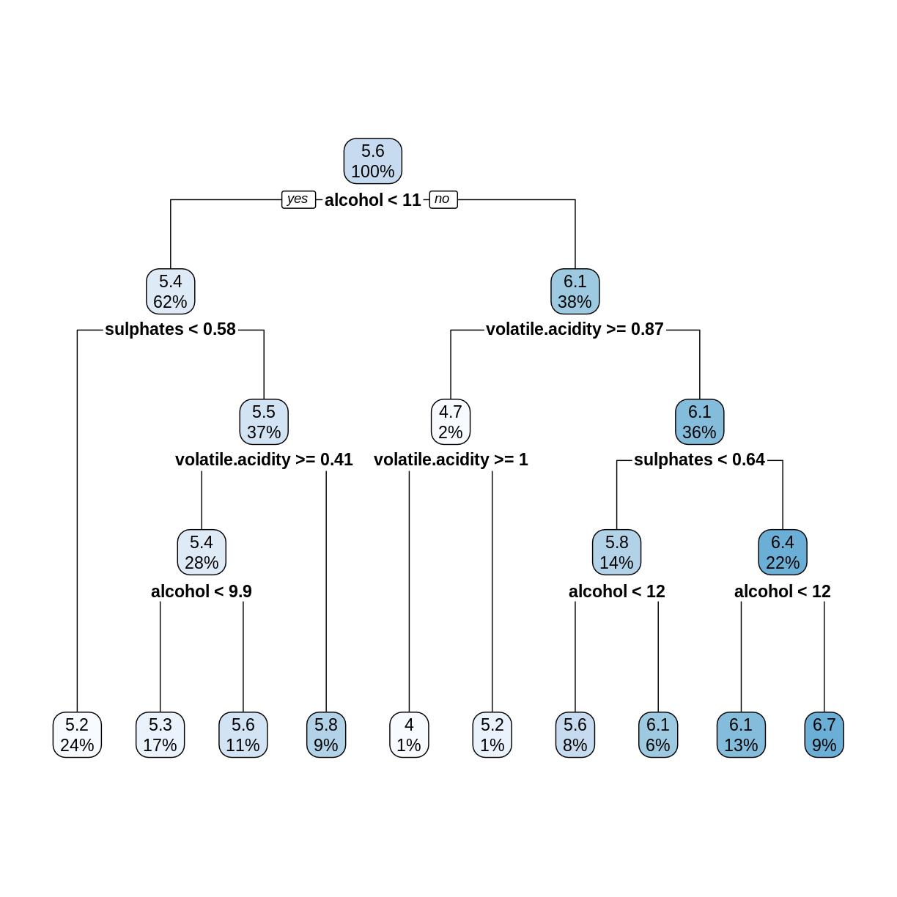

---
# Please do not edit this file directly; it is auto generated.
# Instead, please edit 04-Decision-Forests.md in _episodes_rmd/
source: Rmd
title: "Random Forests"
teaching: 45 
exercises: 30
questions:
- "What are random forests?"
- "How do random forests improve decision tree models?"
objectives:
- "Introduce random forests."
- "Use random forests for classification and regression models."
- "Evaluate the quality of a random forest model."
keypoints:
- "Random forests can make predictions of a categorical or quantitative variable."
- "Random forests, with their default settings, work reasonably well."
---

We saw in the previous episode that decision tree models can be sensitive to small changes in the training data. *Random Forests* mitigate this issue by forming an *ensemble* (i.e., set) of decision trees, and using them all together to make a prediction.

## Wine Dataset

For this episode, we will use a data set described in the [article](https://doi.org/10.1016/j.dss.2009.05.016) *Modeling wine preferences by data mining from physicochemical properties*, in Decision Support Systems, 47(4):547-553, by P. Cortez, A. Cerdeira, F. Almeida, T. Matos and J. Reis. (Instructions for downloading this data set are in the [setup page](../setup.html).) The data set contains quality ratings and measurements from 6497 samples of wine; rows `1:1599` are red wine samples, and rows `1600:6497` are white wine. 

~~~
library(tidyverse)
library(here)
wine <- read_csv(here("data", "wine.csv"))
~~~
{: .language-r}

~~~
glimpse(wine)
~~~
{: .language-r}

~~~
Rows: 6,497
Columns: 12
$ fixed.acidity        <dbl> 7.4, 7.8, 7.8, 11.2, 7.4, 7.4, 7.9, 7.3, 7.8, 7.5…
$ volatile.acidity     <dbl> 0.700, 0.880, 0.760, 0.280, 0.700, 0.660, 0.600, …
$ citric.acid          <dbl> 0.00, 0.00, 0.04, 0.56, 0.00, 0.00, 0.06, 0.00, 0…
$ residual.sugar       <dbl> 1.9, 2.6, 2.3, 1.9, 1.9, 1.8, 1.6, 1.2, 2.0, 6.1,…
$ chlorides            <dbl> 0.076, 0.098, 0.092, 0.075, 0.076, 0.075, 0.069, …
$ free.sulfur.dioxide  <dbl> 11, 25, 15, 17, 11, 13, 15, 15, 9, 17, 15, 17, 16…
$ total.sulfur.dioxide <dbl> 34, 67, 54, 60, 34, 40, 59, 21, 18, 102, 65, 102,…
$ density              <dbl> 0.9978, 0.9968, 0.9970, 0.9980, 0.9978, 0.9978, 0…
$ pH                   <dbl> 3.51, 3.20, 3.26, 3.16, 3.51, 3.51, 3.30, 3.39, 3…
$ sulphates            <dbl> 0.56, 0.68, 0.65, 0.58, 0.56, 0.56, 0.46, 0.47, 0…
$ alcohol              <dbl> 9.4, 9.8, 9.8, 9.8, 9.4, 9.4, 9.4, 10.0, 9.5, 10.…
$ quality              <dbl> 5, 5, 5, 6, 5, 5, 5, 7, 7, 5, 5, 5, 5, 5, 5, 5, 7…
~~~
{: .output}

~~~
ggplot(wine, aes(x = quality)) + geom_histogram(binwidth = 1)
~~~
{: .language-r}

The goal of the models that follow will be to predict the `quality` rating of a wine sample from its chemical properties.

## Red Wine Classification Model

To illustrate classification models with this data set, let's create a categorical variable `grade` that will serve as a response variable.

~~~
redwineClass <- wine %>%
  slice(1:1599) %>%  # just the red wine samples
  mutate(grade = as_factor(if_else(quality < 5.5, "bad", "good"))) %>%  
  select(-quality) # get rid of the quality variable
summary(redwineClass$grade)
~~~
{: .language-r}

~~~
 bad good 
 744  855 
~~~
{: .output}

## Create Training and Test Sets

Create training and test sets using an 80/20 split.

~~~
trainSize <- round(0.80 * nrow(redwineClass))
set.seed(1234) 
trainIndex <- sample(nrow(redwineClass), trainSize)
trainDF <- redwineClass %>% slice(trainIndex)
testDF <- redwineClass %>% slice(-trainIndex)
~~~
{: .language-r}

> ## Challenge: Create a decision tree model
>
> Use the `rpart` function to create a decision tree model for predicting
> the `grade` variable from the remaining columns in the `redwineClass`
> data frame. Use the training and testing sets defined above. Compute
> the testing set accuracy.
>
> > ## Solution
> > 
> > 
> > ~~~
> > library(rpart)
> > library(rpart.plot)
> > rwtree <- rpart(grade ~ ., data = trainDF)
> > rpart.plot(rwtree)
> > ~~~
> > {: .language-r}
> > 
> > 
> > 
> > 
> > ~~~
> > rwp <- predict(rwtree, testDF)
> > rwpred <- ifelse(rwp[,1] > 0.5,  "bad", "good")
> > sum(testDF$grade == rwpred)/nrow(testDF)
> > ~~~
> > {: .language-r}
> > 
> > 
> > 
> > ~~~
> > [1] 0.696875
> > ~~~
> > {: .output}
> > 
> > The decision tree model can correctly predict the grade about 70% of the time.
> > 
> {: .solution}
{: .challenge}

## Random Forest Classification Model

A *random forest* model combines several decision tree models as follows.

* Several different decision trees are built, each from a random bootstrap sample of the same size as the original data. This process is also known as *bagging* (bootstrap aggregation).
* For each tree model, a randomly-chosen subset of variables is chosen to determine each split.
* Each decision tree model makes a prediction, and the category with the most "votes" is selected as the prediction of the random forest.

More details can be found in [Breiman's 2002 paper](https://www.stat.berkeley.edu/~breiman/Using_random_forests_V3.1.pdf), pages 8-9.

The `randomForest` package is an R implementation of Breiman and Cutler's original Fortran code. The syntax for building a model is similar to `lm`, `glm`, and `rpart`. Because of the randomness used in the algorithm, it is good practice to set the random seed so that the results will be reproducible.

~~~
library(randomForest)
set.seed(4567)
redwineForest <- randomForest(grade ~ ., data = trainDF)
~~~
{: .language-r}

The `predict` function works on random forests. Observe that it returns a vector of levels of the `grade` variable.

~~~
rwpred2 <- predict(redwineForest, testDF)
head(rwpred2)
~~~
{: .language-r}

~~~
  1   2   3   4   5   6 
bad bad bad bad bad bad 
Levels: bad good
~~~
{: .output}

> ## Challenge: Accuracy of the Random Forest Model
>
> Compute the testing set accuracy of the random forest model above. Compare this
> accuracy with the decision tree model in the previous challenge.
>
> > ## Solution
> > 
> > 
> > ~~~
> > sum(testDF$grade == rwpred2)/nrow(testDF)
> > ~~~
> > {: .language-r}
> > 
> > 
> > 
> > ~~~
> > [1] 0.821875
> > ~~~
> > {: .output}
> > 
> > The random forest model can correctly predict the grade about 82% of the time,
> > which is an improvement of about 12 percentage points over the decision tree
> > model.
> > 
> {: .solution}
{: .challenge}

## Out-of-bag Error

Since each tree in the random forest is built on a bootstrap sample of the rows in the training set, some rows will be left out of each sample. Each tree can then make a prediction on each row that was excluded, i.e., "out of the bag" (OOB). Each row will be excluded by several trees, which form a subforest that produces an aggregate prediction for each row. The *out-of-bag estimate* of the error rate is the error rate of these predictions. The OOB error rate gives a convenient estimate of the error rate of the model (error = 1 - accuracy). The `print` function reports the OOB error.

~~~
print(redwineForest)
~~~
{: .language-r}

~~~

Call:
 randomForest(formula = grade ~ ., data = trainDF) 
               Type of random forest: classification
                     Number of trees: 500
No. of variables tried at each split: 3

        OOB estimate of  error rate: 19.16%
Confusion matrix:
     bad good class.error
bad  470  119   0.2020374
good 126  564   0.1826087
~~~
{: .output}

The *confusion matrix* gives further details on how the OOB error was calculated: Out of 470+119 bad wines, 119 were classified as good, and out of 126+564 good wines, 126 were classified as bad. Check that (119+126)/(470+119+126+564) = 0.1916.

## Train on the whole data set

Given that OOB error gives us a good way to estimate model accuracy, we can train random forest models on the entire data set, without using a train/test split [(Breiman, 2001, p. 8)](https://www.stat.berkeley.edu/%7Ebreiman/randomforest2001.pdf).

~~~
set.seed(4567)
rwforFull <- randomForest(grade ~ ., data = redwineClass)
print(rwforFull)
~~~
{: .language-r}

~~~

Call:
 randomForest(formula = grade ~ ., data = redwineClass) 
               Type of random forest: classification
                     Number of trees: 500
No. of variables tried at each split: 3

        OOB estimate of  error rate: 16.82%
Confusion matrix:
     bad good class.error
bad  615  129   0.1733871
good 140  715   0.1637427
~~~
{: .output}

*Caveat:* If you plan to "tune" your model by adjusting the optional parameters in `randomForest`, it is still good practice to set aside a testing set for assessing model accuracy after the model has been tuned using only the training data. A train/test split is also helpful if you want to compare random forest models with other types of models.

## Variable Importance

The out-of-bag errors can also be used to assess the importance of each explanatory variable in contributing to the accuracy of the model. If we set `importance = TRUE` in a call to `randomForest`, the function will keep track of how much the OOB accuracy decreases when each variable is randomly permuted. Scrambling a variable in this way effectively removes its predictive power from the model, so we would expect the most important variables to have the greatest decreases in accuracy.

~~~
set.seed(2345)
rwforFull <- randomForest(grade ~ ., data = redwineClass, importance = TRUE)
importance(rwforFull, type = 1)
~~~
{: .language-r}

~~~
                     MeanDecreaseAccuracy
fixed.acidity                    33.60865
volatile.acidity                 50.37700
citric.acid                      30.12944
residual.sugar                   31.40780
chlorides                        34.39463
free.sulfur.dioxide              32.60753
total.sulfur.dioxide             50.95265
density                          42.35901
pH                               36.46366
sulphates                        58.41187
alcohol                          75.06260
~~~
{: .output}

> ## Challenge: Most and Least Important
>
> Based on the Mean Decrease in Accuracy,
> Which two variables are the most important, and which two are the least 
> important? Are these results consistent with the decision tree model you
> constructed in the first challence of this episode?
>
> > ## Solution
> >
> > For convenience, let's sort the rows of the importance matrix.
> > 
> > 
> > ~~~
> > importance(rwforFull, type = 1) %>% 
> > as_tibble(rownames = "Variable") %>% 
> >   arrange(desc(MeanDecreaseAccuracy))
> > ~~~
> > {: .language-r}
> > 
> > 
> > 
> > ~~~
> > # A tibble: 11 × 2
> >    Variable             MeanDecreaseAccuracy
> >    <chr>                               <dbl>
> >  1 alcohol                              75.1
> >  2 sulphates                            58.4
> >  3 total.sulfur.dioxide                 51.0
> >  4 volatile.acidity                     50.4
> >  5 density                              42.4
> >  6 pH                                   36.5
> >  7 chlorides                            34.4
> >  8 fixed.acidity                        33.6
> >  9 free.sulfur.dioxide                  32.6
> > 10 residual.sugar                       31.4
> > 11 citric.acid                          30.1
> > ~~~
> > {: .output}
> > 
> > The top two variables are `alcohol` and `sulphates`, which both occur near
> > the root of the decision tree. The least important variables are `residual.sugar`
> > and `citric.acid`, which do not occur in the decision tree. So it seems 
> > consistent that the important variables play important roles in the decision 
> > tree, while the unimportant variables do not.
> > 
> {: .solution}
{: .challenge}

## Red Wine Regression Model

So far, we have applied decision trees and random forests to classification problems, where the dependent variable is categorical. These techniques also apply to regression problems, where we are predicting a quantitative variable.

Recall that in the original `wine` data set, there is a variable called `quality` that assigns each sample a numerical quality score. For the examples that follow, we will treat `quality` as a quantitative variable. As before, we select the rows that contain observations of red wines, and we form training and testing sets.

~~~
redwine <- wine %>% slice(1:1599) 
trainSize <- round(0.80 * nrow(redwine))
set.seed(1234) 
trainIndex <- sample(nrow(redwine), trainSize)
trainDF <- redwine %>% slice(trainIndex)
testDF <- redwine %>% slice(-trainIndex)
~~~
{: .language-r}

## Fit a Decision Tree

When the dependent variable is quantitative, we use the `method = "anova"` option in `rpart` to construct a decision tree. In this situation, the predicted value corresponding to each node is the mean value of the observations assigned to the node, and the algorithm searches for a split that minimizes the sum of the squared errors of these predictions.

~~~
rwtree <- rpart(quality ~ ., data = trainDF, method = "anova")
rpart.plot(rwtree)
~~~
{: .language-r}

> ## Challenge: Check the Splits
>
> In the above decision tree, consider the root (5.6), its left child (5.4),
> and the leftmost leaf (5.2). Check that these numbers are in fact the average
> `quality` values (rounded to one decimal place) of the observations in `trainDF` 
> that are assigned to each node.
>
> > ## Solution
> >
> > The root node contains all the observations, so compute its mean `quality` value.
> > 
> > 
> > ~~~
> > mean(trainDF$quality)
> > ~~~
> > {: .language-r}
> > 
> > 
> > 
> > ~~~
> > [1] 5.636435
> > ~~~
> > {: .output}
> > 
> > The left child of the root contains observations where `alcohol` is less than 11.
> > 
> > 
> > ~~~
> > trainDF %>% 
> >   filter(alcohol < 11) %>% 
> >   summarize(nodeValue = mean(quality))
> > ~~~
> > {: .language-r}
> > 
> > 
> > 
> > ~~~
> > # A tibble: 1 × 1
> >   nodeValue
> >       <dbl>
> > 1      5.42
> > ~~~
> > {: .output}
> > 
> > The leftmost leaf contains observations where `alcohol` is less than 11 and
> > `sulphates` is less than 0.58. 
> > 
> > 
> > ~~~
> > trainDF %>% 
> >   filter(alcohol < 11, sulphates < 0.58) %>% 
> >   summarize(nodeValue = mean(quality))
> > ~~~
> > {: .language-r}
> > 
> > 
> > 
> > ~~~
> > # A tibble: 1 × 1
> >   nodeValue
> >       <dbl>
> > 1      5.16
> > ~~~
> > {: .output}
> > 
> {: .solution}
{: .challenge}

## Decision Tree RMSE

For regression trees, each leaf is assigned a predicted value, and the `predict` function selects the appropriate leaf/prediction based on the values of the explanatory variables.

~~~
predictedQuality <- predict(rwtree, testDF)
head(predictedQuality)
~~~
{: .language-r}

~~~
       1        2        3        4        5        6 
5.154839 5.278027 5.278027 5.154839 5.154839 5.602837 
~~~
{: .output}

Since this is a regression model, we assess its performance using the root mean squared error (RMSE).

~~~
errors <- predictedQuality - testDF$quality
decTreeRMSE <- sqrt(mean(errors^2))
decTreeRMSE
~~~
{: .language-r}

~~~
[1] 0.6862169
~~~
{: .output}

## Random Forest Regression Model

Constructing a random forest regression model uses `randomForest` with the same syntax as we used for classification models. The only difference is that the response variable `quality` in our formula is a quantitative variable. The predicted values given by `predict` are the average predictions of all the trees in the forest.

~~~
set.seed(4567)
rwfor <- randomForest(quality ~ ., data = trainDF)
predQualRF <- predict(rwfor, testDF) 
rfErrors <- predQualRF - testDF$quality
rfRMSE <- sqrt(mean(rfErrors^2))
rfRMSE
~~~
{: .language-r}

~~~
[1] 0.5913485
~~~
{: .output}

The random forest RMSE is better (smaller) than the decision tree RMSE.

~~~
print(rwfor)
~~~
{: .language-r}

~~~

Call:
 randomForest(formula = quality ~ ., data = trainDF) 
               Type of random forest: regression
                     Number of trees: 500
No. of variables tried at each split: 3

          Mean of squared residuals: 0.3269279
                    % Var explained: 49.5
~~~
{: .output}

The `Mean of squared residuals` is the MSE of the out-of-bag errors. The `% Var explained` term is a "pseudo R-squared", computed as 1 - MSE/Var(y). The OOB MSE should be close to the MSE on the testing set. So again, you don't always need a train/test split when working with random forests.

We conclude this episode with a series of challenges.

> ## Challenge: Variable Importance
>
> As with classification models, setting `importance = TRUE` in a call to `randomForest`
> will use the OOB errors to measure variable importance. In the regression case,
> the decrease in performance when a variable is permuted is measured by the percentage
> increase in MSE (`%IncMSE`). The larger the `%IncMSE`, the more important the
> variable.
>
> Compute the `%IncMSE` variable importance for the red wine regression model,
> and sort the variables by their importance. Re-train the model on the 
> entire `redwine` data set instead of on the testing set. 
> Are the most important variables the same as in the classification model?
>
> > ## Solution
> >
> > The syntax is almost identical to the classification case. Since the 
> > identifier `%IncMSE` contains special characters, it must be enclosed
> > in backticks.
> > 
> > 
> > ~~~
> > set.seed(2345)
> > rwFull <- randomForest(quality ~ ., data = redwine, importance = TRUE)
> > importance(rwFull, type = 1) %>%
> >   as_tibble(rownames = "Variable") %>% 
> >   arrange(desc(`%IncMSE`))
> > ~~~
> > {: .language-r}
> > 
> > 
> > 
> > ~~~
> > # A tibble: 11 × 2
> >    Variable             `%IncMSE`
> >    <chr>                    <dbl>
> >  1 alcohol                   59.2
> >  2 sulphates                 55.6
> >  3 volatile.acidity          39.7
> >  4 total.sulfur.dioxide      38.3
> >  5 density                   34.5
> >  6 chlorides                 32.7
> >  7 free.sulfur.dioxide       30.0
> >  8 citric.acid               28.9
> >  9 fixed.acidity             28.4
> > 10 pH                        25.1
> > 11 residual.sugar            24.2
> > ~~~
> > {: .output}
> > 
> > The top five most important variables are the same as in the classification
> > model, but their order is slightly different. The variable `pH` seems to be
> > relatively more important in the classification model.
> > 
> {: .solution}
{: .challenge}

> ## Challenge: Linear Regression Model
>
> In Episode 2, we used the `lm` function to fit a linear model to the 
> training set, and then we computed the RMSE on the testing set. Repeat
> this process for the `redwine` data set. How does the linear regression
> RMSE compare to the random forest RMSE? Compare the `summary` of your 
> linear model with the variable importance rankings from the previous
> challenge.
>
> > ## Solution
> >
> > 
> > ~~~
> > redwine.lm <- lm(quality ~ ., data = trainDF)
> > lmRMSE <- sqrt(mean((predict(redwine.lm, testDF) - testDF$quality)^2))
> > lmRMSE
> > ~~~
> > {: .language-r}
> > 
> > 
> > 
> > ~~~
> > [1] 0.6880957
> > ~~~
> > {: .output}
> >
> > The random forest RMSE is less than the linear model RMSE.
> > 
> > 
> > ~~~
> > summary(redwine.lm)
> > ~~~
> > {: .language-r}
> > 
> > 
> > 
> > ~~~
> > 
> > Call:
> > lm(formula = quality ~ ., data = trainDF)
> > 
> > Residuals:
> >      Min       1Q   Median       3Q      Max 
> > -2.68737 -0.36035 -0.03507  0.43456  1.95898 
> > 
> > Coefficients:
> >                        Estimate Std. Error t value Pr(>|t|)    
> > (Intercept)           9.3242378 23.4596015   0.397   0.6911    
> > fixed.acidity         0.0108114  0.0284758   0.380   0.7043    
> > volatile.acidity     -1.2144573  0.1320387  -9.198  < 2e-16 ***
> > citric.acid          -0.2957551  0.1608745  -1.838   0.0662 .  
> > residual.sugar        0.0193480  0.0168430   1.149   0.2509    
> > chlorides            -1.8858347  0.4583915  -4.114 4.14e-05 ***
> > free.sulfur.dioxide   0.0054883  0.0023783   2.308   0.0212 *  
> > total.sulfur.dioxide -0.0034664  0.0007974  -4.347 1.49e-05 ***
> > density              -5.0636470 23.9244350  -0.212   0.8324    
> > pH                   -0.4331191  0.2065623  -2.097   0.0362 *  
> > sulphates             0.9244109  0.1306583   7.075 2.47e-12 ***
> > alcohol               0.2886439  0.0293633   9.830  < 2e-16 ***
> > ---
> > Signif. codes:  0 '***' 0.001 '**' 0.01 '*' 0.05 '.' 0.1 ' ' 1
> > 
> > Residual standard error: 0.6385 on 1267 degrees of freedom
> > Multiple R-squared:  0.3762,	Adjusted R-squared:  0.3708 
> > F-statistic: 69.46 on 11 and 1267 DF,  p-value: < 2.2e-16
> > ~~~
> > {: .output}
> >
> > The variables the smallest p-values (`Pr(>|t|)`) tend to correspond to 
> > the most important variables in the random forest model. 
> > 
> {: .solution}
{: .challenge}

> ## Challenge: White Wine
>
> Rows 1600-6497 of the `wine` data frame correspond to white wine observations.
> Use these rows to train and test a random forest model, as we did with the
> red wine observations. Compute a testing set RMSE, and assess variable
> importance. Are the important variables for predicting white wine quality
> the same as the important variables for predicting red wine quality?
>
> > ## Solution
> > 
> > 
> > ~~~
> > whitewine <- wine %>% slice(1600:6497) 
> > trainSize <- round(0.80 * nrow(whitewine))
> > set.seed(1234) 
> > trainIndex <- sample(nrow(whitewine), trainSize)
> > trainDF <- whitewine %>% dplyr::slice(trainIndex)
> > testDF <- whitewine %>% dplyr::slice(-trainIndex)
> > wwfor <- randomForest(quality ~ ., data = trainDF)
> > predQualww <- predict(wwfor, testDF) 
> > errors <- predQualww - testDF$quality
> > wwRMSE <- sqrt(mean(errors^2))
> > ~~~
> > {: .language-r}
> >
> > The RMSE on the white wine testing set is about 0.63.
> > 
> > 
> > ~~~
> > set.seed(4567)
> > wwforFull <- randomForest(quality ~ ., data = whitewine, importance = TRUE)
> > importance(wwforFull, type = 1) %>% 
> >   as_tibble(rownames = "Variable") %>% 
> >   arrange(desc(`%IncMSE`))
> > ~~~
> > {: .language-r}
> > 
> > Relative to red wine, `free.sulfur.dioxide` is much more important for
> > predicting white wine quality, and `sulphates` is less important.
> > 
> {: .solution}
{: .challenge}

