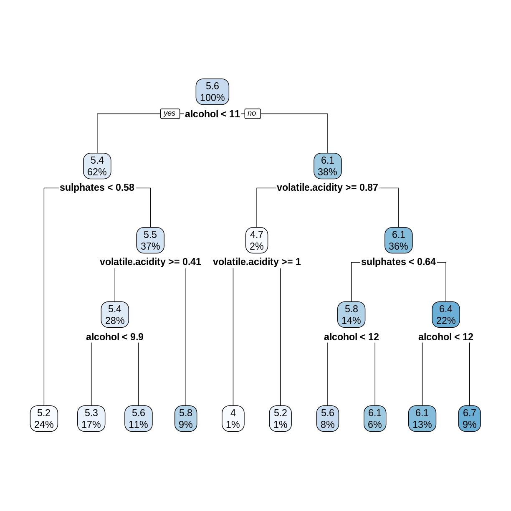
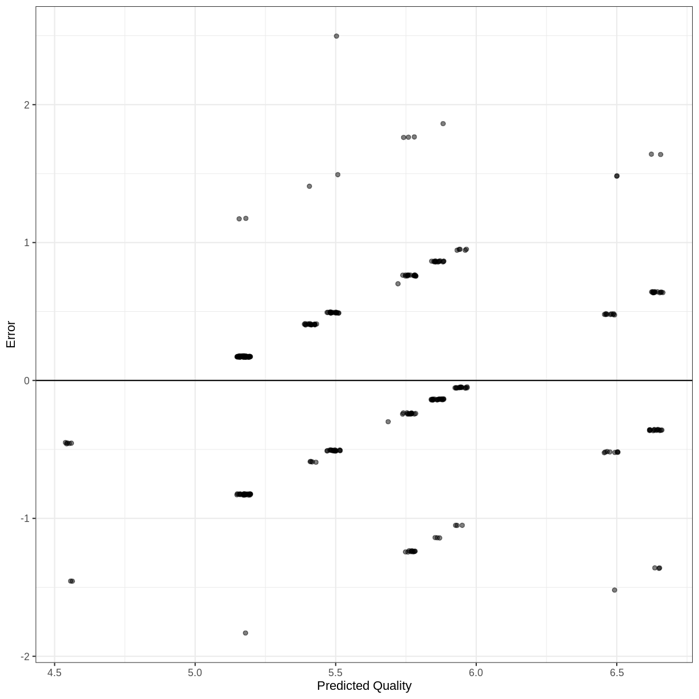
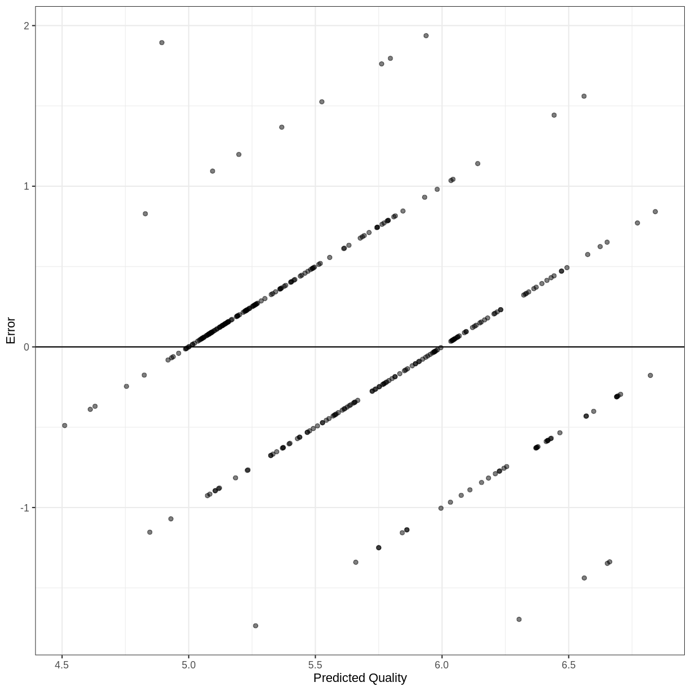

---
# Please do not edit this file directly; it is auto generated.
# Instead, please edit 04-Decision-Forests.md in _episodes_rmd/
source: Rmd
title: "Decision Forests"
teaching: 50 
exercises: 20
questions:
- "What are decision forests?"
- "How can we use a decision tree model to make a prediction?"
- "How do decision forests improve decision tree models?"
objectives:
- "Introduce decision forests."
- "Use decision forests for classification and regression models."
- "Evaluate the quality of a decision forest model."
keypoints:
- "Decision forests can make predictions of a categorical or quantitative variable."
- "Decision forests, with their default settings, work reasonably well."
---

## Decision Forests

TODO:

## Wine Dataset

For this episode, we will use a data set described in the [article](https://doi.org/10.1016/j.dss.2009.05.016) *Modeling wine preferences by data mining from physicochemical properties*, in Decision Support Systems, 47(4):547-553, by P. Cortez, A. Cerdeira, F. Almeida, T. Matos and J. Reis. The data set contains quality ratings and measurements from 6497 samples of wine; rows `1:1599` are red wine samples, and rows `1600:6497` are white wine. 

~~~
library(tidyverse)
library(here)
wine <- read_csv(here("data", "wine.csv"))
~~~
{: .language-r}

~~~
glimpse(wine)
~~~
{: .language-r}

~~~
Rows: 6,497
Columns: 12
$ fixed.acidity        <dbl> 7.4, 7.8, 7.8, 11.2, 7.4, 7.4, 7.9, 7.3, 7.8, 7.5…
$ volatile.acidity     <dbl> 0.700, 0.880, 0.760, 0.280, 0.700, 0.660, 0.600, …
$ citric.acid          <dbl> 0.00, 0.00, 0.04, 0.56, 0.00, 0.00, 0.06, 0.00, 0…
$ residual.sugar       <dbl> 1.9, 2.6, 2.3, 1.9, 1.9, 1.8, 1.6, 1.2, 2.0, 6.1,…
$ chlorides            <dbl> 0.076, 0.098, 0.092, 0.075, 0.076, 0.075, 0.069, …
$ free.sulfur.dioxide  <dbl> 11, 25, 15, 17, 11, 13, 15, 15, 9, 17, 15, 17, 16…
$ total.sulfur.dioxide <dbl> 34, 67, 54, 60, 34, 40, 59, 21, 18, 102, 65, 102,…
$ density              <dbl> 0.9978, 0.9968, 0.9970, 0.9980, 0.9978, 0.9978, 0…
$ pH                   <dbl> 3.51, 3.20, 3.26, 3.16, 3.51, 3.51, 3.30, 3.39, 3…
$ sulphates            <dbl> 0.56, 0.68, 0.65, 0.58, 0.56, 0.56, 0.46, 0.47, 0…
$ alcohol              <dbl> 9.4, 9.8, 9.8, 9.8, 9.4, 9.4, 9.4, 10.0, 9.5, 10.…
$ quality              <dbl> 5, 5, 5, 6, 5, 5, 5, 7, 7, 5, 5, 5, 5, 5, 5, 5, 7…
~~~
{: .output}

~~~
ggplot(wine, aes(x = quality)) + geom_histogram(binwidth = 1)
~~~
{: .language-r}

## Red Wine Classification Model

~~~
redwineC <- wine %>%
  slice(1:1599) %>%
  mutate(grade = as_factor(if_else(quality < 5.5, "bad", "good"))) %>%  
  select(-quality)
summary(redwineC$grade)
~~~
{: .language-r}

~~~
 bad good 
 744  855 
~~~
{: .output}

## Create Training and Test Sets

~~~
trainSize <- round(0.80 * nrow(redwineC))
set.seed(1234) 
trainIndex <- sample(nrow(redwineC), trainSize)
trainDF <- redwineC %>% slice(trainIndex)
testDF <- redwineC %>% slice(-trainIndex)
~~~
{: .language-r}

## Fit a Decision Tree

~~~
library(rpart)
library(rpart.plot)
rwtree <- rpart(grade ~ ., data = trainDF, method = "class")
rpart.plot(rwtree)
~~~
{: .language-r}

~~~
rwp <- predict(rwtree, testDF)
rwpred <- apply(rwp, 1, function(r) {names(which.max(r))})
sum(testDF$grade == rwpred)/nrow(testDF)
~~~
{: .language-r}

~~~
[1] 0.696875
~~~
{: .output}

## Now do it with a random forest

~~~
library(randomForest)
~~~
{: .language-r}

~~~
randomForest 4.7-1
~~~
{: .output}

~~~
Type rfNews() to see new features/changes/bug fixes.
~~~
{: .output}

~~~

Attaching package: 'randomForest'
~~~
{: .output}

~~~
The following object is masked from 'package:dplyr':

    combine
~~~
{: .output}

~~~
The following object is masked from 'package:ggplot2':

    margin
~~~
{: .output}

~~~
set.seed(4567)
rwfor <- randomForest(grade ~ ., data = trainDF)
rwpred2 <- predict(rwfor, testDF)
sum(testDF$grade == rwpred2)/nrow(testDF)
~~~
{: .language-r}

~~~
[1] 0.821875
~~~
{: .output}

## Examine our Random Forest

~~~
print(rwfor)
~~~
{: .language-r}

~~~

Call:
 randomForest(formula = grade ~ ., data = trainDF) 
               Type of random forest: classification
                     Number of trees: 500
No. of variables tried at each split: 3

        OOB estimate of  error rate: 19.16%
Confusion matrix:
     bad good class.error
bad  470  119   0.2020374
good 126  564   0.1826087
~~~
{: .output}

## Train on the whole data set

~~~
set.seed(567)
rwforFull <- randomForest(grade ~ ., data = redwineC)
print(rwforFull)
~~~
{: .language-r}

~~~

Call:
 randomForest(formula = grade ~ ., data = redwineC) 
               Type of random forest: classification
                     Number of trees: 500
No. of variables tried at each split: 3

        OOB estimate of  error rate: 16.64%
Confusion matrix:
     bad good class.error
bad  618  126   0.1693548
good 140  715   0.1637427
~~~
{: .output}

## Variable Importance

~~~
importance(rwforFull)
~~~
{: .language-r}

~~~
                     MeanDecreaseGini
fixed.acidity                53.36714
volatile.acidity             85.98563
citric.acid                  52.65787
residual.sugar               44.08492
chlorides                    59.12602
free.sulfur.dioxide          47.00822
total.sulfur.dioxide         80.23087
density                      71.76048
pH                           53.40917
sulphates                   104.83733
alcohol                     142.50949
~~~
{: .output}

~~~
importance(rwforFull) %>% 
  as_tibble(rownames = "Variable") %>% 
  arrange(desc(MeanDecreaseGini))
~~~
{: .language-r}

~~~
# A tibble: 11 × 2
   Variable             MeanDecreaseGini
   <chr>                           <dbl>
 1 alcohol                         143. 
 2 sulphates                       105. 
 3 volatile.acidity                 86.0
 4 total.sulfur.dioxide             80.2
 5 density                          71.8
 6 chlorides                        59.1
 7 pH                               53.4
 8 fixed.acidity                    53.4
 9 citric.acid                      52.7
10 free.sulfur.dioxide              47.0
11 residual.sugar                   44.1
~~~
{: .output}

## Red Wine Regression Model

~~~
redwineR <- wine %>% slice(1:1599) 
trainSize <- round(0.80 * nrow(redwineR))
set.seed(124) 
trainIndex <- sample(nrow(redwineR), trainSize)
trainDF <- redwineR %>% slice(trainIndex)
testDF <- redwineR %>% slice(-trainIndex)
~~~
{: .language-r}

## Fit a Decision Tree

When the dependent variable is quantitative, we use the `anova` method to construct a decision tree.

~~~
rwtree <- rpart(quality ~ ., data = trainDF, method = "anova")
rpart.plot(rwtree)
~~~
{: .language-r}

## Decision Tree RMSE

~~~
predQualDT <- predict(rwtree, testDF)
dtErrors <- predQualDT - testDF$quality
dtRMSE <- sqrt(mean(dtErrors^2))
dtRMSE
~~~
{: .language-r}

~~~
[1] 0.6750109
~~~
{: .output}

## Plot Residuals vs. Fitted

~~~
tibble(`Predicted Quality` = predQualDT, Error = dtErrors) %>%
  ggplot(aes(x = `Predicted Quality`, y = Error))  +
  geom_jitter(alpha = 0.5) +
  geom_abline(slope = 0, intercept = 0) +
  theme_bw()
~~~
{: .language-r}

## Random Forest Regression Model

~~~
set.seed(4567)
rwfor <- randomForest(quality ~ ., data = trainDF)
print(rwfor)
~~~
{: .language-r}

~~~

Call:
 randomForest(formula = quality ~ ., data = trainDF) 
               Type of random forest: regression
                     Number of trees: 500
No. of variables tried at each split: 3

          Mean of squared residuals: 0.33194
                    % Var explained: 49.77
~~~
{: .output}

The `% Var explained` term is a "pseudo R-squared", computed as $1 - \text{MSE}/\text{Var}(y)$.
The mean of squared residuals is based on the errors for the entire training set. Note that it's square root is close to the RMSE we calculated on the test set. 

~~~
predQualRF <- predict(rwfor, testDF) 
rfErrors <- predQualRF - testDF$quality
rfRMSE <- sqrt(mean(rfErrors^2))
rfRMSE
~~~
{: .language-r}

~~~
[1] 0.5759838
~~~
{: .output}

~~~
rfRMSE^2
~~~
{: .language-r}

~~~
[1] 0.3317574
~~~
{: .output}

You can also view the out-of-bag errors. The average OOB MSE is close to the MSE on the training set. So again, you don't really need a train-test split when working with decision forests.

~~~
mean(rwfor$mse)
~~~
{: .language-r}

~~~
[1] 0.3399423
~~~
{: .output}

### Plot the errors

~~~
tibble(`Predicted Quality` = predQualRF, Error = rfErrors) %>%
  ggplot(aes(x = `Predicted Quality`, y = Error))  +
  geom_jitter(alpha = 0.5) +
  geom_abline(slope = 0, intercept = 0) +
  theme_bw()
~~~
{: .language-r}

## Variable Importance

~~~
importance(rwfor)
~~~
{: .language-r}

~~~
                     IncNodePurity
fixed.acidity             47.07776
volatile.acidity         111.03786
citric.acid               57.41817
residual.sugar            42.24075
chlorides                 54.27190
free.sulfur.dioxide       40.01365
total.sulfur.dioxide      66.54188
density                   66.48752
pH                        45.91699
sulphates                107.82435
alcohol                  160.21565
~~~
{: .output}

~~~
importance(rwfor) %>% 
  as_tibble(rownames = "Variable") %>% 
  arrange(desc(IncNodePurity))
~~~
{: .language-r}

~~~
# A tibble: 11 × 2
   Variable             IncNodePurity
   <chr>                        <dbl>
 1 alcohol                      160. 
 2 volatile.acidity             111. 
 3 sulphates                    108. 
 4 total.sulfur.dioxide          66.5
 5 density                       66.5
 6 citric.acid                   57.4
 7 chlorides                     54.3
 8 fixed.acidity                 47.1
 9 pH                            45.9
10 residual.sugar                42.2
11 free.sulfur.dioxide           40.0
~~~
{: .output}

## Linear Regression Model (Optional)

~~~
redwine.lm <- lm(quality ~ ., data = trainDF)
summary(redwine.lm)
~~~
{: .language-r}

~~~

Call:
lm(formula = quality ~ ., data = trainDF)

Residuals:
     Min       1Q   Median       3Q      Max 
-2.71767 -0.35788 -0.05016  0.42668  2.07145 

Coefficients:
                       Estimate Std. Error t value Pr(>|t|)    
(Intercept)           3.542e+01  2.362e+01   1.500 0.133919    
fixed.acidity         4.808e-02  2.958e-02   1.625 0.104337    
volatile.acidity     -1.231e+00  1.339e-01  -9.189  < 2e-16 ***
citric.acid          -2.816e-01  1.627e-01  -1.731 0.083717 .  
residual.sugar        2.416e-02  1.653e-02   1.461 0.144183    
chlorides            -1.703e+00  4.528e-01  -3.760 0.000178 ***
free.sulfur.dioxide   4.446e-03  2.408e-03   1.846 0.065121 .  
total.sulfur.dioxide -3.208e-03  7.868e-04  -4.077 4.84e-05 ***
density              -3.151e+01  2.412e+01  -1.306 0.191640    
pH                   -3.947e-01  2.161e-01  -1.827 0.067999 .  
sulphates             8.763e-01  1.293e-01   6.776 1.89e-11 ***
alcohol               2.733e-01  2.937e-02   9.304  < 2e-16 ***
---
Signif. codes:  0 '***' 0.001 '**' 0.01 '*' 0.05 '.' 0.1 ' ' 1

Residual standard error: 0.6441 on 1267 degrees of freedom
Multiple R-squared:  0.3782,	Adjusted R-squared:  0.3728 
F-statistic: 70.07 on 11 and 1267 DF,  p-value: < 2.2e-16
~~~
{: .output}

~~~
lmRMSE <- sqrt(mean((predict(redwine.lm, testDF) - testDF$quality)^2))
lmRMSE
~~~
{: .language-r}

~~~
[1] 0.6672557
~~~
{: .output}

Challenge: Train a random forest on entire `redwineR` dataset. Do the MSE and pseudo R-squared improve?

Solution:

~~~
set.seed(4567)
rwfor <- randomForest(quality ~ ., data = redwineR)
print(rwfor)
~~~
{: .language-r}

Challenge? White wine decision forest regression model (whole dataset). Are the important variables different for ratings of white wine? also try with just train and test.

Solution:

Using train/test sets:

~~~
whitewine <- wine %>% slice(1600:6497) 
trainSize <- round(0.80 * nrow(whitewine))
set.seed(1234) 
trainIndex <- sample(nrow(whitewine), trainSize)
trainDF <- whitewine %>% dplyr::slice(trainIndex)
testDF <- whitewine %>% dplyr::slice(-trainIndex)
wwfor <- randomForest(quality ~ ., data = trainDF)
predQualRF <- predict(wwfor, testDF) 
rfErrors <- predQualRF - testDF$quality
rfRMSE <- sqrt(mean(rfErrors^2))
~~~
{: .language-r}

random forest rmse: 0.631

~~~
set.seed(4567)
wwforFull <- randomForest(quality ~ ., data = whitewine)
print(wwforFull)
importance(wwforFull) %>% 
  as_tibble(rownames = "Variable") %>% 
  arrange(desc(IncNodePurity))
~~~
{: .language-r}

For comparison: linear model:

~~~
whitewine.lm <- lm(quality ~ ., data = trainDF)
lmRMSE <- sqrt(mean((predict(whitewine.lm, testDF) - testDF$quality)^2))
~~~
{: .language-r}

linear model rmse: 0.7942

Note: We have correlated variables in this data set. Random forests handle them fairly well.

Challenge: Try increasing `mtry` and `ntree`. Do the results improve?

Solution:

~~~
set.seed(4567)
wwfor <- randomForest(quality ~ ., data = whitewineR, mtry = 5)
print(wwfor)
~~~
{: .language-r}

~~~
set.seed(4567)
wwfor <- randomForest(quality ~ ., data = whitewineR, ntree = 1000)
print(wwfor)
~~~
{: .language-r}

Neither of the above changes has much of an effect.
