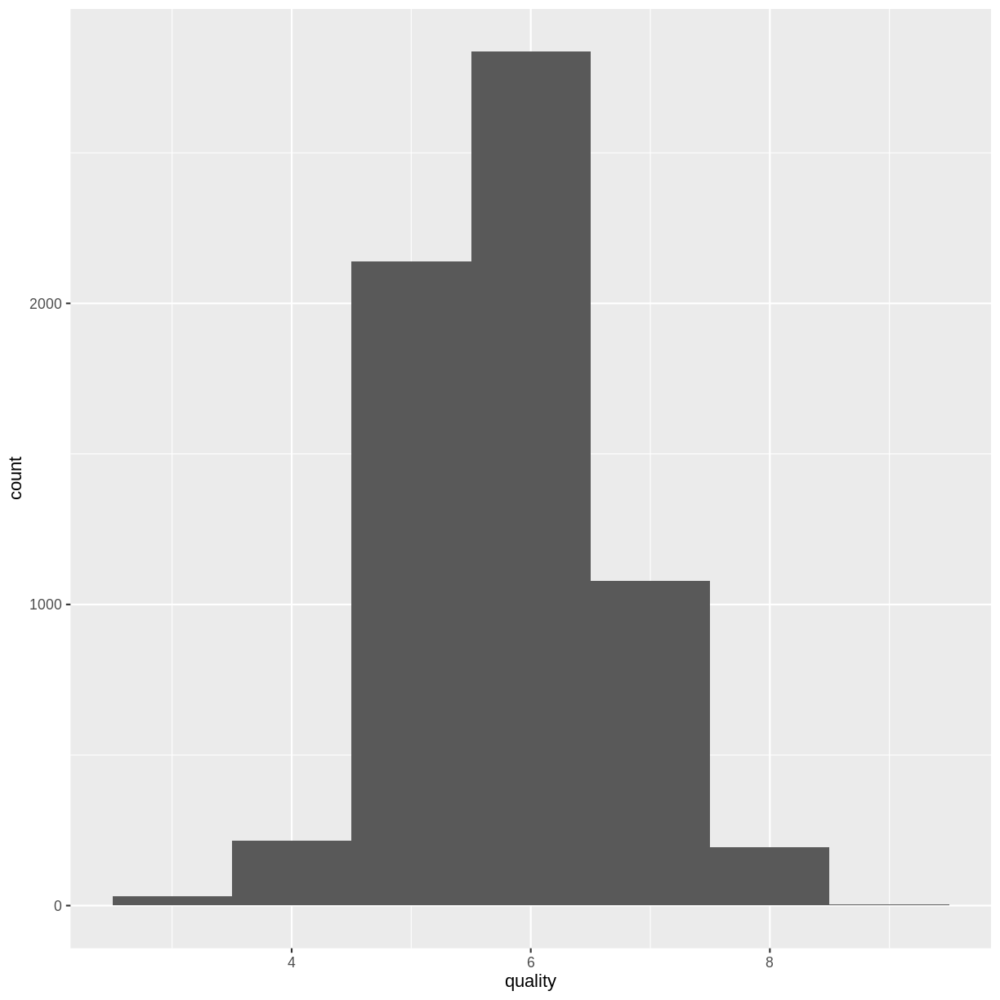

---
# Please do not edit this file directly; it is auto generated.
# Instead, please edit 04-Decision-Forests.md in _episodes_rmd/
source: Rmd
title: "Decision Forests"
teaching: 50 
exercises: 15
questions:
- "What are decision forests?"
- "How can we use a decision tree model to make a prediction?"
- "How do decision forests improve decision tree models?"
objectives:
- "Introduce decision forests."
- "TODO"
keypoints:
- "TODO"
---

## Decision Forests

TODO: 

## Yeast dataset (UCI)

~~~
library(tidyverse)
~~~
{: .language-r}

~~~
── Attaching packages ─────────────────────────────────────── tidyverse 1.3.1 ──
~~~
{: .output}

~~~
✔ ggplot2 3.3.5     ✔ purrr   0.3.4
✔ tibble  3.1.6     ✔ dplyr   1.0.8
✔ tidyr   1.2.0     ✔ stringr 1.4.0
✔ readr   2.1.2     ✔ forcats 0.5.1
~~~
{: .output}

~~~
── Conflicts ────────────────────────────────────────── tidyverse_conflicts() ──
✖ dplyr::filter() masks stats::filter()
✖ dplyr::lag()    masks stats::lag()
~~~
{: .output}

~~~
library(rpart)
yeast <- read_csv("https://datahub.io/machine-learning/yeast/r/yeast.csv") %>%
  mutate(class_protein_localization = as_factor(class_protein_localization))
~~~
{: .language-r}

~~~
Rows: 1484 Columns: 9
~~~
{: .output}

~~~
── Column specification ────────────────────────────────────────────────────────
Delimiter: ","
chr (1): class_protein_localization
dbl (8): mcg, gvh, alm, mit, erl, pox, vac, nuc

ℹ Use `spec()` to retrieve the full column specification for this data.
ℹ Specify the column types or set `show_col_types = FALSE` to quiet this message.
~~~
{: .output}

~~~
ytree <- rpart(class_protein_localization ~ ., data = yeast, method = "class")
par(xpd = TRUE)
plot(ytree)
text(ytree)
~~~
{: .language-r}

~~~
yp <- predict(ytree)
ypred <- apply(yp, 1, function(r) {names(which.max(r))})
sum(yeast$class_protein_localization == ypred)/nrow(yeast)
~~~
{: .language-r}

~~~
[1] 0.6024259
~~~
{: .output}

## Now do it with a random forest

~~~
library(randomForest)
~~~
{: .language-r}

~~~
randomForest 4.7-1
~~~
{: .output}

~~~
Type rfNews() to see new features/changes/bug fixes.
~~~
{: .output}

~~~

Attaching package: 'randomForest'
~~~
{: .output}

~~~
The following object is masked from 'package:dplyr':

    combine
~~~
{: .output}

~~~
The following object is masked from 'package:ggplot2':

    margin
~~~
{: .output}

~~~
yfor <- randomForest(class_protein_localization ~ ., data = yeast)
ypred2 <- predict(yfor, yeast)
sum(ypred2 == yeast$class_protein_localization)/nrow(yeast)
~~~
{: .language-r}

~~~
[1] 0.9851752
~~~
{: .output}

