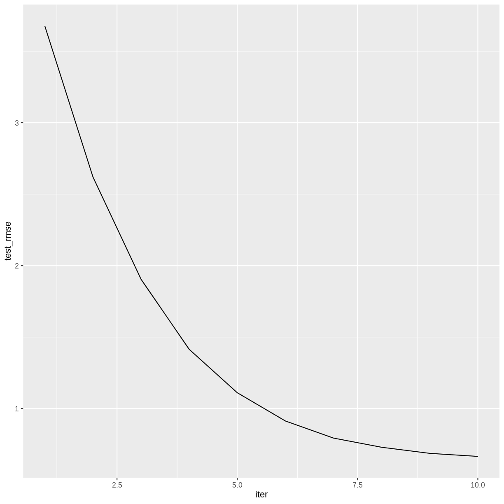
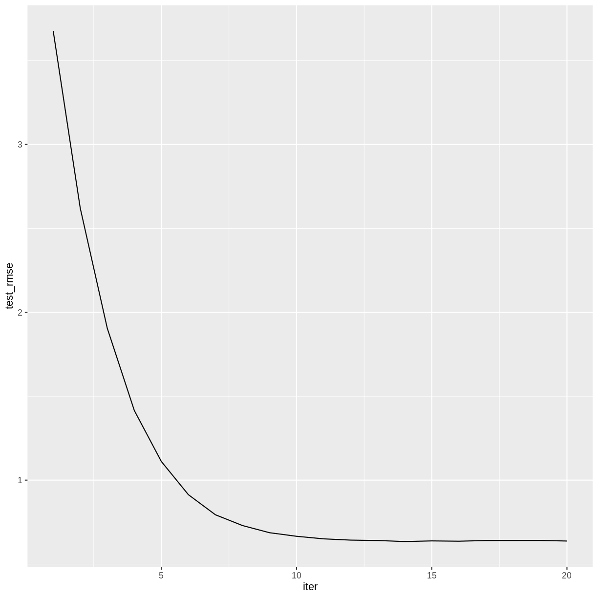
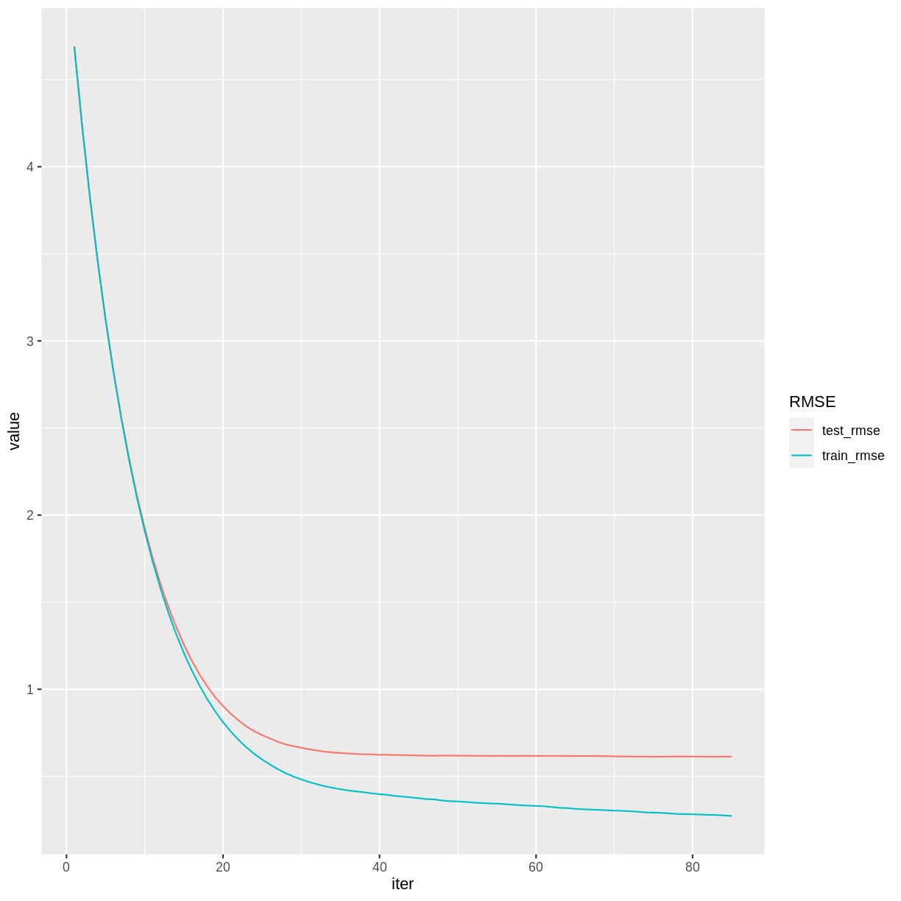

---
# Please do not edit this file directly; it is auto generated.
# Instead, please edit 05-Gradient-Boosting.md in _episodes_rmd/
source: Rmd
title: "Gradient Boosted Trees"
teaching: 45 
exercises: 25
questions:
- "What is gradient boosting?"
- "How can we train an XGBoost model?"
- "What is the learning rate?"
objectives:
- "Introduce XGBoost models."
- "Train regression models using XGBoost"
- "Explore the effect of learning rate on the training process."
keypoints:
- "Gradient boosted trees can be used for the same types of problems that random forests can solve."
- "The learning rate can affect the performance of a machine learning algorithm."
---

## Gradient Boosted Trees

A random forest is called an *ensemble* method, because it combines the results of a set of trees to form a single prediction. *Gradient boosted trees* are also ensemble methods, but instead of forming a forest of trees from different random samples, they grow successive trees that systematically reduce the error of the model at each iteration.

We will be using the R package `xgboost`, which gives a fast, scalable implementation of a gradient boosting framework. For more information on how `xgboost` works, see the [XGBoost Presentation](https://cran.r-project.org/web/packages/xgboost/vignettes/xgboostPresentation.html) vignette and the [Introduction to Boosted Trees](https://xgboost.readthedocs.io/en/stable/tutorials/model.html) tutorial in the XGBoost documentation. In this episode we will use XGBoost to create a regression model, but this framework can also be used for classification problems.

## Reload the Red Wine Data

~~~
library(tidyverse)
library(here)
~~~
{: .language-r}

~~~
library(xgboost)
~~~
{: .language-r}

~~~

Attaching package: 'xgboost'
~~~
{: .output}

~~~
The following object is masked from 'package:dplyr':

    slice
~~~
{: .output}

Notice that both `xgboost` and `dplyr` have a function called `slice`. In the following code block, we specify that we want to use the `dplyr` version.

~~~
wine <- read_csv(here("data", "wine.csv"))
redwine <- wine %>% dplyr::slice(1:1599) 
trainSize <- round(0.80 * nrow(redwine))
set.seed(1234) 
trainIndex <- sample(nrow(redwine), trainSize)
trainDF <- redwine %>% dplyr::slice(trainIndex)
testDF <- redwine %>% dplyr::slice(-trainIndex)
~~~
{: .language-r}

The `xgboost` package defines a data structure called `xgb.DMatrix` that optimizes storage and retrieval. To use the advanced features of `xgboost`, it is necessary to convert our training and test sets to the `xgb.DMatrix` class.

~~~
dtrain <- xgb.DMatrix(data = as.matrix(select(trainDF, -quality)), label = trainDF$quality)
dtest <- xgb.DMatrix(data = as.matrix(select(testDF, -quality)), label = testDF$quality)
~~~
{: .language-r}

## Training an XGBoost Model

Since we specified a `label` in our `dtrain` and `dtest` matrices, there is no need to specify a formula when training a model using `xgb.train`. The label that we specified (quality rating) will be the response variable, and the columns of the `data` that we specified will be the explanatory variables. One option that we must specify is `nrounds`, which restricts the number of boosting iterations the algorithm will make.

~~~
redwineXGB <- xgb.train(data = dtrain, nrounds = 10)
~~~
{: .language-r}

Let's calculate the RMSE on our testing set. The `predict` function for XGBoost models expects a matrix, so we pass it the `xgb.DMatrix` that we created from our testing set. 

~~~
pQuality <- predict(redwineXGB, dtest)
errors <- pQuality - testDF$quality
sqrt(mean(errors^2)) #RMSE
~~~
{: .language-r}

~~~
[1] 0.6653935
~~~
{: .output}

## More Details on the Training Process

The `xgb.train` command will automatically calculate the RMSE on our testing set after each iteration if we set the testing set in the `watchlist`.

~~~
redwineXGB <- xgb.train(data = dtrain, watchlist = list(test = dtest), nrounds = 10)
~~~
{: .language-r}

~~~
[1]	test-rmse:3.676492 
[2]	test-rmse:2.620643 
[3]	test-rmse:1.904736 
[4]	test-rmse:1.414777 
[5]	test-rmse:1.110905 
[6]	test-rmse:0.913236 
[7]	test-rmse:0.793578 
[8]	test-rmse:0.729415 
[9]	test-rmse:0.686777 
[10]	test-rmse:0.665393 
~~~
{: .output}

The training history is saved as a data frame in the variable `gbm$evaluation_log`, so we can plot how the RMSE changes during the training process.

~~~
redwineXGB$evaluation_log %>%
  ggplot(aes(x = iter, y = test_rmse)) +
  geom_line()
~~~
{: .language-r}

> ## Challenge: How many boosting iterations?
>
> Experiment with different values of `nrounds` in the above call to `xgb.train`.
> Does the accuracy of the model improve with more iterations? Is there a point 
> after which the model ceases to improve?
>
> > ## Solution
> > 
> > The accuracy of the model doesn't appear to improve after iteration 14.
> >
> > 
> > ~~~
> > redwineXGB <- xgb.train(data = dtrain, 
> >                         watchlist = list(test = dtest), 
> >                         nrounds = 20)
> > ~~~
> > {: .language-r}
> > 
> > 
> > 
> > ~~~
> > [1]	test-rmse:3.676492 
> > [2]	test-rmse:2.620643 
> > [3]	test-rmse:1.904736 
> > [4]	test-rmse:1.414777 
> > [5]	test-rmse:1.110905 
> > [6]	test-rmse:0.913236 
> > [7]	test-rmse:0.793578 
> > [8]	test-rmse:0.729415 
> > [9]	test-rmse:0.686777 
> > [10]	test-rmse:0.665393 
> > [11]	test-rmse:0.650133 
> > [12]	test-rmse:0.642655 
> > [13]	test-rmse:0.640231 
> > [14]	test-rmse:0.634134 
> > [15]	test-rmse:0.637910 
> > [16]	test-rmse:0.636140 
> > [17]	test-rmse:0.640103 
> > [18]	test-rmse:0.640305 
> > [19]	test-rmse:0.640569 
> > [20]	test-rmse:0.637183 
> > ~~~
> > {: .output}
> > 
> > 
> > 
> > ~~~
> > redwineXGB$evaluation_log %>%
> >   ggplot(aes(x = iter, y = test_rmse)) +
> >   geom_line() 
> > ~~~
> > {: .language-r}
> > 
> > 
> > 
> {: .solution}
{: .challenge}

## Learning Rate

Machine learning algorithms that reduce a loss function over a sequence of iterations typically have a setting that controls the *learning rate*. A smaller learning rate will generally reduce the error by a smaller amount at each iteration, and therefore will require more iterations to arrive at a given level of accuracy. The advantage to a smaller learning rate is that the algorithm is less likely to overshoot the optimum fit.

In XGBoost, the setting that controls the learning rate is called `eta`, which is one of several *hyperparameters* that can be adjusted. Its default value is 0.3, but smaller values will usually perform better. It must take a value in the range 0 < `eta` < 1. 

The following code will set `eta` to its default value. We include a value for `early_stopping_rounds`, which will halt the training after a specified number of iterations pass without improvement. When using `early_stopping_rounds`, `nrounds` can be set to a very large number. To avoid printing too many lines of output, we also set a value for `print_every_n`.

~~~
redwineXGB <- xgb.train(data = dtrain, 
                        params = list(eta = 0.3),
                        watchlist = list(test = dtest), 
                        nrounds = 1000,
                        early_stopping_rounds = 10,
                        print_every_n = 5)
~~~
{: .language-r}

~~~
[1]	test-rmse:3.676492 
Will train until test_rmse hasn't improved in 10 rounds.

[6]	test-rmse:0.913236 
[11]	test-rmse:0.650133 
[16]	test-rmse:0.636140 
[21]	test-rmse:0.639540 
Stopping. Best iteration:
[14]	test-rmse:0.634134
~~~
{: .output}

The 14th iteration had the smallest RMSE, as we found in the previous challenge.

> ## Challenge: Experiment with the learning rate.
>
> Experiment with different values of `eta` in the above call to `xgb.train`.
> Notice how smaller values of eta require more iterations. Can you find a 
> value of `eta` that results in a lower testing set RMSE than the default?
>
> > ## Solution
> > 
> > A learning rate around 0.1 reduces the RMSE somewhat.
> >
> > 
> > ~~~
> > redwineXGB <- xgb.train(data = dtrain, 
> >                         params = list(eta = 0.1),
> >                         watchlist = list(test = dtest), 
> >                         nrounds = 1000,
> >                         early_stopping_rounds = 10,
> >                         print_every_n = 15)
> > ~~~
> > {: .language-r}
> > 
> > 
> > 
> > ~~~
> > [1]	test-rmse:4.689984 
> > Will train until test_rmse hasn't improved in 10 rounds.
> > 
> > [16]	test-rmse:1.164598 
> > [31]	test-rmse:0.655252 
> > [46]	test-rmse:0.618707 
> > [61]	test-rmse:0.617009 
> > [76]	test-rmse:0.612820 
> > Stopping. Best iteration:
> > [75]	test-rmse:0.612406
> > ~~~
> > {: .output}
> > 
> {: .solution}
{: .challenge}

## Variable Importance

As with random forests, you can view the predictive importance of each explanatory variable.

~~~
xgb.importance(model = redwineXGB)
~~~
{: .language-r}

~~~
                 Feature       Gain      Cover  Frequency
 1:              alcohol 0.33236129 0.11264259 0.07936508
 2:     volatile.acidity 0.12367170 0.09820458 0.11922399
 3:            sulphates 0.10975935 0.10726694 0.08218695
 4: total.sulfur.dioxide 0.07500529 0.13655797 0.09276896
 5:              density 0.05960668 0.09451465 0.08500882
 6:            chlorides 0.05883225 0.10318293 0.09805996
 7:       residual.sugar 0.05499778 0.09106117 0.08818342
 8:        fixed.acidity 0.05087633 0.07920964 0.14250441
 9:                   pH 0.04772447 0.06078573 0.06807760
10:          citric.acid 0.04532904 0.07698668 0.07830688
11:  free.sulfur.dioxide 0.04183582 0.03958713 0.06631393
~~~
{: .output}

The rows are sorted by `Gain`, which measures the accuracy improvement contributed by a feature based on all the splits it determines. Note that the sum of all the gains is 1.

## Training Error vs. Testing Error

Like many machine learning algorithms, gradient boosting operates by minimizing the error on the training set. However, we evaluate its performance by computing the error on the testing set. These two errors are usually different, and it is not uncommon to have much lower training RMSE than testing RMSE. 

To see both training and testing errors, we can add a `train` item to the `watchlist`.

~~~
redwineXGB <- xgb.train(data = dtrain, 
                        params = list(eta = 0.1),
                        watchlist = list(train = dtrain, test = dtest), 
                        nrounds = 1000,
                        early_stopping_rounds = 10,
                        print_every_n = 15)
~~~
{: .language-r}

~~~
[1]	train-rmse:4.690120	test-rmse:4.689984 
Multiple eval metrics are present. Will use test_rmse for early stopping.
Will train until test_rmse hasn't improved in 10 rounds.

[16]	train-rmse:1.109302	test-rmse:1.164598 
[31]	train-rmse:0.467275	test-rmse:0.655252 
[46]	train-rmse:0.369513	test-rmse:0.618707 
[61]	train-rmse:0.328256	test-rmse:0.617009 
[76]	train-rmse:0.290210	test-rmse:0.612820 
Stopping. Best iteration:
[75]	train-rmse:0.291627	test-rmse:0.612406
~~~
{: .output}

~~~
redwineXGB$evaluation_log %>% 
  pivot_longer(cols = c(train_rmse, test_rmse), names_to = "RMSE") %>% 
  ggplot(aes(x = iter, y = value, color = RMSE)) + geom_line()
~~~
{: .language-r}

Notice that beyond iteration 40 or so, the training RMSE continues to decrease while the testing RMSE has basically stabilized. This divergence indicates that the later training iterations are improving the model based on the particularities of the training set, but in a way that does not generalize to the testing set.

> ## Challenge: White Wine
>
> Build an XGBoost model for the white wine data (rows 1600-6497) of the
> `wine` data frame. Compare the RMSE and variable importance with 
> the random forest white wine model from the previous episode.
>
> > ## Solution
> >
> > 
> > ~~~
> > whitewine <- wine %>% dplyr::slice(1600:6497) 
> > trainSize <- round(0.80 * nrow(whitewine))
> > set.seed(1234) 
> > trainIndex <- sample(nrow(whitewine), trainSize)
> > trainDF <- whitewine %>% dplyr::slice(trainIndex)
> > testDF <- whitewine %>% dplyr::slice(-trainIndex)
> > dtrain <- xgb.DMatrix(data = as.matrix(select(trainDF, -quality)), 
> >                       label = trainDF$quality)
> > dtest <- xgb.DMatrix(data = as.matrix(select(testDF, -quality)), 
> >                      label = testDF$quality)
> > whitewineXGB <- xgb.train(data = dtrain, 
> >                           params = list(eta = 0.1),
> >                           watchlist = list(train = dtrain, test = dtest), 
> >                           nrounds = 1000,
> >                           early_stopping_rounds = 10,
> >                           print_every_n = 20)
> > xgb.importance(model = whitewineXGB)
> > whitewineXGB$evaluation_log %>% 
> >   pivot_longer(cols = c(train_rmse, test_rmse), names_to = "RMSE") %>% 
> >   ggplot(aes(x = iter, y = value, color = RMSE)) + geom_line()
> > ~~~
> > {: .language-r}
> > 
> > The testing set RMSE (0.664) is worse than what we obtained in the 
> > random forest model (0.63). The important explanatory variables are similar.
> > 
> {: .solution}
{: .challenge}

So far, our XGBoost models have performed slightly worse than the equivalent random forest models. In the next episode we will explore ways to improve these results.
