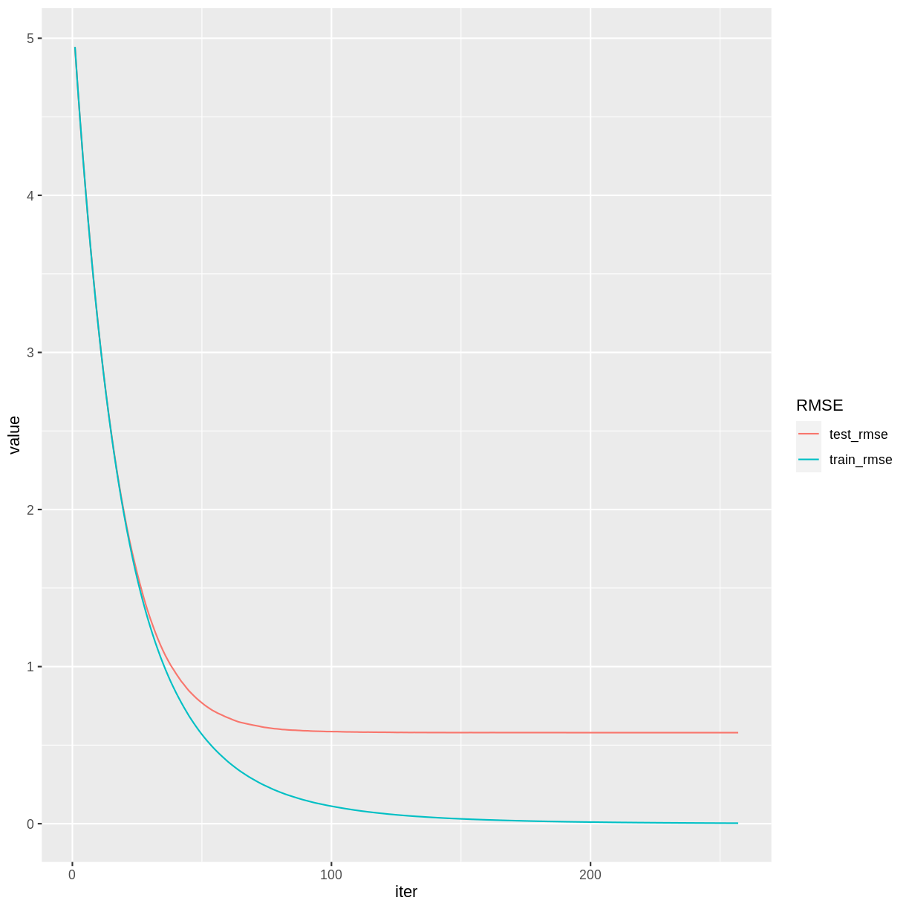

---
# Please do not edit this file directly; it is auto generated.
# Instead, please edit 06-Exploration.md in _episodes_rmd/
source: Rmd
title: "Cross Validation and Tuning"
teaching: 45 
exercises: 30
questions:
- "How can the fit of an XGBoost model be improved?"
- "What is cross validation?"
- "What are some guidelines for tuning parameters in a machine learning algorithm?"
objectives:
- "Explore the effects of adjusting the XGBoost parameters."
- "Practice some coding techniques to tune parameters using grid searching and cross validation."
keypoints:
- "Parameter tuning can improve the fit of an XGBoost model."
- "Cross validation allows us to tune parameters using the training set only, saving the testing set for final model evaluation."
---

## Parameter Tuning

Like many other machine learning algorithms, XGBoost has an assortment of *parameters* that control the behavior of the training process. To improve the fit of the model, we can adjust, or *tune*, these parameters. According to the [notes on parameter tuning](https://xgboost.readthedocs.io/en/stable/tutorials/param_tuning.html) in the XGBoost documentation, "[p]arameter tuning is a dark art in machine learning," so it is difficult to prescribe an automated process for doing so. In this episode we will develop some coding practices for tuning an XGBoost model, but be advised that the optimal way to tune a model will depend heavily on the given data set.

You can find a complete list of XGBoost parameters in [the documentation](https://xgboost.readthedocs.io/en/stable/parameter.html). Generally speaking, each parameter controls the complexity of the model in some way. More complex models tend to fit the training data more closely, but such models can be very sensitive to small changes in the training set. On the other hand, while less complex models can be more conservative in this respect, they have a harder time modeling intricate relationships. The "art" of parameter tuning lies in finding an appropriately complex model for the problem at hand.

A complete discussion of the issues involved are beyond the scope of this lesson. An excellent resource on the topic is [An Introduction to Statistical Learning](https://hastie.su.domains/ISLR2/ISLRv2_website.pdf), by James, Witten, Hastie, and Tibshirani. In particular, Section 2.2.2 discusses the *Bias-Variance Trade-Off* inherent in statistical learning methods.

## Cross Validation

How will we be able to tell if an adjustment to a parameter has improved the model? One possible approach would be to test the model before and after the adjustment on the testing set. However, the problem with this method is that it runs the risk of tuning the model to the particular properties of the testing set, rather than to general future cases that we might encounter. It is better practice to save our testing set until the very end of the process, and then use it to test the accuracy of our model. Training set accuracy, as we have seen, tends to underestimate the accuracy of a machine learning model, so tuning to the training set may also fail to make improvements that generalize. 

An alternative testing procedure is to use *cross validation* on the training set to judge the effect of tuning adjustments.  In *k*-fold cross validation, the training set is partitioned randomly into *k* subsets. Each of these subsets takes a turn as a testing set, while the model is trained on the remaining data. The accuracy of the model is then measured *k* times, and the results are averaged to obtain an estimate of the overall model accuracy. In this way we can be more certain that repeated adjustments will be tested in ways that generalize to future observations. It also allows us to save the original testing set for a final test of our tuned model.

## Revisit the Red Wine Quality Model

Let's see if we can improve the previous episode's model for predicting red wine quality.

~~~
library(tidyverse)
library(here)
library(xgboost)
wine <- read_csv(here("data", "wine.csv"))
redwine <- wine %>% dplyr::slice(1:1599) 
trainSize <- round(0.80 * nrow(redwine))
set.seed(1234) 
trainIndex <- sample(nrow(redwine), trainSize)
trainDF <- redwine %>% dplyr::slice(trainIndex)
testDF <- redwine %>% dplyr::slice(-trainIndex)
dtrain <- xgb.DMatrix(data = as.matrix(select(trainDF, -quality)), label = trainDF$quality)
dtest <- xgb.DMatrix(data = as.matrix(select(testDF, -quality)), label = testDF$quality)
~~~
{: .language-r}

The `xgb.cv` command handles most of the details of the cross validation process. Since this is a random process, we will set a seed value for reproducibility. We will use 10 folds and the default value of 0.3 for `eta`.

~~~
set.seed(524)
rwCV <- xgb.cv(params = list(eta = 0.3),
               data = dtrain, 
               nfold = 10,
               nrounds = 500,
               early_stopping_rounds = 10,
               print_every_n = 5)
~~~
{: .language-r}

~~~
[1]	train-rmse:3.676824+0.003733	test-rmse:3.682796+0.044551 
Multiple eval metrics are present. Will use test_rmse for early stopping.
Will train until test_rmse hasn't improved in 10 rounds.

[6]	train-rmse:0.808822+0.003848	test-rmse:0.888110+0.043011 
[11]	train-rmse:0.418891+0.013364	test-rmse:0.641062+0.037335 
[16]	train-rmse:0.343756+0.012450	test-rmse:0.628046+0.033493 
[21]	train-rmse:0.299929+0.010728	test-rmse:0.625757+0.033106 
[26]	train-rmse:0.258271+0.013402	test-rmse:0.624861+0.036458 
[31]	train-rmse:0.225188+0.013268	test-rmse:0.623947+0.042251 
[36]	train-rmse:0.194026+0.011849	test-rmse:0.624094+0.042001 
Stopping. Best iteration:
[29]	train-rmse:0.236075+0.013368	test-rmse:0.622687+0.041345
~~~
{: .output}

The output appears similar to the `xgb.train` command. Notice that each error estimate now includes a standard deviation, because these estimates are formed by averaging over all ten folds. The function returns a list,  which we have given the name `rwCV`. Its `names` hint at what each list item represents.

~~~
names(rwCV)
~~~
{: .language-r}

~~~
[1] "call"            "params"          "callbacks"       "evaluation_log" 
[5] "niter"           "nfeatures"       "folds"           "best_iteration" 
[9] "best_ntreelimit"
~~~
{: .output}

> ## Challenge: Examine the cross validation results
>
> 1. Examine the list item `rwCV$folds`. 
>    What do suppose these numbers represent? 
>    Are all the folds the same size? Can you explain why/why not?
> 2. Display the evaluation log with rows sorted by `test_rmse_mean`.
> 3. How could you display only the row containing the best iteration?
>
> > ## Solution
> > 
> > 1. The numbers are the indexes of the rows in each fold. The folds are not
> >    all the same size, because no row can be used more than once, and there 
> >    are 1279 rows total in the training set, so they don't divide evenly into
> >    10 partitions.
> > 2. 
> >     
> >     ~~~
> >     rwCV$evaluation_log %>% arrange(test_rmse_mean)
> >     ~~~
> >     {: .language-r}
> >     
> >     
> >     
> >     ~~~
> >         iter train_rmse_mean train_rmse_std test_rmse_mean test_rmse_std
> >      1:   29       0.2360750    0.013368348      0.6226874    0.04134490
> >      2:   35       0.2007999    0.011608484      0.6229431    0.04233848
> >      3:   33       0.2134821    0.012373642      0.6229542    0.04233916
> >      4:   32       0.2192703    0.013306955      0.6229588    0.04129835
> >      5:   34       0.2076733    0.012222030      0.6233336    0.04166854
> >      6:   28       0.2426037    0.013287443      0.6233426    0.03899304
> >      7:   31       0.2251878    0.013267807      0.6239475    0.04225134
> >      8:   36       0.1940258    0.011849455      0.6240940    0.04200144
> >      9:   30       0.2310984    0.012281978      0.6241792    0.04091916
> >     10:   27       0.2507866    0.013086816      0.6241843    0.03830991
> >     11:   37       0.1893309    0.011079029      0.6243738    0.04193406
> >     12:   25       0.2659939    0.012269906      0.6245430    0.03553351
> >     13:   39       0.1790856    0.011285008      0.6245503    0.04176559
> >     14:   38       0.1846427    0.010905405      0.6247798    0.04141676
> >     15:   26       0.2582708    0.013402250      0.6248607    0.03645813
> >     16:   23       0.2835744    0.010293100      0.6256707    0.03261529
> >     17:   21       0.2999289    0.010728491      0.6257569    0.03310647
> >     18:   18       0.3203636    0.010830155      0.6257911    0.03230540
> >     19:   22       0.2910245    0.011284146      0.6259865    0.03283513
> >     20:   24       0.2760180    0.012458570      0.6260504    0.03340596
> >     21:   20       0.3067600    0.010738381      0.6262777    0.03185302
> >     22:   17       0.3320214    0.011822742      0.6271510    0.03445198
> >     23:   19       0.3119272    0.010392821      0.6272786    0.03191304
> >     24:   15       0.3564079    0.012468678      0.6273193    0.03434991
> >     25:   16       0.3437564    0.012450158      0.6280460    0.03349317
> >     26:   14       0.3679581    0.011806629      0.6285073    0.03311778
> >     27:   13       0.3802030    0.011004878      0.6307059    0.03545827
> >     28:   12       0.3983362    0.010466897      0.6353593    0.03506220
> >     29:   11       0.4188905    0.013364106      0.6410624    0.03733492
> >     30:   10       0.4497433    0.011540044      0.6501031    0.04014740
> >     31:    9       0.4915645    0.010805274      0.6679334    0.03942590
> >     32:    8       0.5556933    0.007217608      0.7061343    0.03954675
> >     33:    7       0.6565486    0.004032585      0.7713876    0.04152207
> >     34:    6       0.8088225    0.003847863      0.8881101    0.04301120
> >     35:    5       1.0398669    0.003228572      1.0914671    0.04090907
> >     36:    4       1.3825695    0.002820641      1.4113087    0.03738249
> >     37:    3       1.8857284    0.002530300      1.9004059    0.04118868
> >     38:    2       2.6184095    0.002917347      2.6270221    0.04337352
> >     39:    1       3.6768236    0.003733214      3.6827955    0.04455107
> >         iter train_rmse_mean train_rmse_std test_rmse_mean test_rmse_std
> >     ~~~
> >     {: .output}
> > 3. 
> >     
> >     ~~~
> >     rwCV$evaluation_log[rwCV$best_iteration]
> >     ~~~
> >     {: .language-r}
> >     
> >     
> >     
> >     ~~~
> >        iter train_rmse_mean train_rmse_std test_rmse_mean test_rmse_std
> >     1:   29        0.236075     0.01336835      0.6226874     0.0413449
> >     ~~~
> >     {: .output}
> > 
> {: .solution}
{: .challenge}

## Repeat Cross Validation in a Loop

To expedite the tuning process, it helps to design a loop to run repeated cross validations on different parameter values. We can start by choosing a value of `eta` from a list of candidate values.

~~~
paramDF <- tibble(eta = c(0.001, 0.01, 0.05, 0.1, 0.2, 0.3, 0.4))
~~~
{: .language-r}

The following command converts a data frame to a list of lists. The `split` function splits `paramDF` into a list of its rows, and then the `lapply` function converts each row to a list. Each item of `paramlist` will be a list giving a valid parameter setting that we can use in the `xgb.cv` function.

~~~
paramList <- lapply(split(paramDF, 1:nrow(paramDF)), as.list)
~~~
{: .language-r}

Now we will write a loop that will perform a different cross validation for each parameter setting in the `paramList` list. We'll keep track of the best iterations in the `bestResults` tibble. To avoid too much printing, we set `verbose = FALSE` and use a `txtProgressBar` to keep track of our progress. On some systems, it may be necessary to use `gc()` to prevent running out of memory.

~~~
bestResults <- tibble()
set.seed(708)
pb <- txtProgressBar(style = 3) 
for(i in seq(length(paramList))) {
  rwCV <- xgb.cv(params = paramList[[i]], 
                 data = dtrain, 
                 nrounds = 500, 
                 nfold = 10,
                 early_stopping_rounds = 10,
                 verbose = FALSE)
  bestResults <- bestResults %>% 
    bind_rows(rwCV$evaluation_log[rwCV$best_iteration])
  gc() # Free unused memory after each loop iteration
  setTxtProgressBar(pb, i/length(paramList))
}
close(pb) # done with the progress bar
~~~
{: .language-r}

We now have all of the best iterations in the `bestResults` data frame, which we can combine with the data frame of parameter values.

~~~
etasearch <- bind_cols(paramDF, bestResults)
~~~
{: .language-r}

In RStudio, it is convenient to use `View(etasearch)` to view the results in a separate tab. We can use the RStudio interface to sort by `mean_test_rmse`.

Note that there is not much difference in `mean_test_rmse` among the best three choices. As we have seen in the previous episode, the choice of `eta` typically involves a trade-off between speed and accuracy. A common approach is to pick a reasonable value of `eta` and then stick with it for the rest of the tuning process. Let's use `eta` = 0.1, because it uses about half as many steps as `eta` = 0.05, and the accuracy is comparable.

## Grid Search

Sometimes it helps to tune a pair of related parameters together. A *grid search* runs through all possible combinations of candidate values for a selection of parameters. 

We will tune the parameters `max_depth` and `max_leaves` together. These both affect the size the trees that the algorithm grows. Deeper trees with more leaves make the model more complex. We use the `expand.grid` function to store some reasonable candidate values in `paramDF`. 

~~~
paramDF <- expand.grid(
  max_depth = seq(15, 29, by = 2),
  max_leaves = c(63, 127, 255, 511, 1023, 2047, 4095),
  eta = 0.1)
~~~
{: .language-r}

If you `View(paramDF)` you can see that we have 56 different parameter choices to run through. The rest of the code is the same as before, but this loop might take a while to execute.

~~~
paramList <- lapply(split(paramDF, 1:nrow(paramDF)), as.list)
bestResults <- tibble()
set.seed(312)
pb <- txtProgressBar(style = 3)
for(i in seq(length(paramList))) {
  rwCV <- xgb.cv(params = paramList[[i]],
                 data = dtrain, 
                 nrounds = 500, 
                 nfold = 10,
                 early_stopping_rounds = 10,
                 verbose = FALSE)
  bestResults <- bestResults %>% 
    bind_rows(rwCV$evaluation_log[rwCV$best_iteration])
  gc() 
  setTxtProgressBar(pb, i/length(paramList))
}
close(pb)
depth_leaves <- bind_cols(paramDF, bestResults)
~~~
{: .language-r}

When we `View(depth_leaves)` we see that a choice of `max_depth` = 21 and `max_leaves` = 4095 results in the best `test_rmse_mean`. One caveat is that cross validation is a random process, so running this code with a different random seed may very well produce a different result. However, there are several comparable results with `max_depth` in the 20s and `max_leaves` in the 1000s, so we can be pretty sure that our choice these parameter values is sound.

> ## Challenge: Write a Grid Search Function
>
> Instead of repeatedly using the above code block, let's package it into 
> an [R function](https://swcarpentry.github.io/r-novice-inflammation/02-func-R/).
> Define a function called `GridSearch` that consumes a data frame `paramDF`
> of candidate parameter values 
> and an `xgb.DMatrix` `dtrain` of training data. The function should
> return a data frame combining the columns of `paramDF` with the 
> corresponding results of the best cross validation iteration. The returned
> data frame should be sorted in ascending order of `test_rmse_mean`.
>
> > ## Solution
> > 
> > 
> > ~~~
> > GridSearch <- function(paramDF, dtrain) {
> >   paramList <- lapply(split(paramDF, 1:nrow(paramDF)), as.list)
> >   bestResults <- tibble()
> >   pb <- txtProgressBar(style = 3)
> >   for(i in seq(length(paramList))) {
> >     rwCV <- xgb.cv(params = paramList[[i]],
> >                    data = dtrain, 
> >                    nrounds = 500, 
> >                    nfold = 10,
> >                    early_stopping_rounds = 10,
> >                    verbose = FALSE)
> >     bestResults <- bestResults %>% 
> >       bind_rows(rwCV$evaluation_log[rwCV$best_iteration])
> >     gc() 
> >     setTxtProgressBar(pb, i/length(paramList))
> >   }
> >   close(pb)
> >   return(bind_cols(paramDF, bestResults) %>% arrange(test_rmse_mean))
> > }
> > ~~~
> > {: .language-r}
> > 
> > Check the function on a small example.
> >
> > 
> > ~~~
> > set.seed(630)
> > GridSearch(tibble(eta = c(0.3, 0.2, 0.1)), dtrain)
> > ~~~
> > {: .language-r}
> > 
> > 
> > 
> > ~~~
> > 
  |                                                                            
  |                                                                      |   0%
  |                                                                            
  |=======================                                               |  33%
  |                                                                            
  |===============================================                       |  67%
  |                                                                            
  |======================================================================| 100%
> > ~~~
> > {: .output}
> > 
> > 
> > 
> > ~~~
> > # A tibble: 3 × 6
> >     eta  iter train_rmse_mean train_rmse_std test_rmse_mean test_rmse_std
> >   <dbl> <dbl>           <dbl>          <dbl>          <dbl>         <dbl>
> > 1   0.1   100           0.220        0.00805          0.589        0.0543
> > 2   0.2    40           0.256        0.0123           0.598        0.0426
> > 3   0.3    41           0.170        0.00669          0.610        0.0468
> > ~~~
> > {: .output}
> > 
> {: .solution}
{: .challenge}

## Adding Random Sampling

Adding random sampling to the training process can help make the model less dependent on the training set, and hopefully more accurate when generalizing to future cases. In XGBoost, the two parameters `subsample` and `colsample_bytree` will grow trees based on a random sample of a specified percentage of rows and columns, respectively. Typical values for these parameters are between 0.5 and 1.0 (where 1.0 implies that no random sampling will be done).

> ## Challenge: Tune Row and Column Sampling
>
> Use a grid search to tune the parameters `subsample` and `colsample_bytree`. 
> Choose candidate values between 0.5 and 1.0. Use our previously chosen values
> of `eta`, `max_depth`, and `max_leaves`.
>
> > ## Solution
> > 
> > 
> > ~~~
> > paramDF <- expand.grid(
> >   subsample = seq(0.5, 1, by = 0.1),
> >   colsample_bytree = seq(0.5, 1, by = 0.1),
> >   max_depth = 21,
> >   max_leaves = 4095,
> >   eta = 0.1)
> > set.seed(848)
> > randsubsets <- GridSearch(paramDF, dtrain)
> > ~~~
> > {: .language-r}
> > 
> > It appears that some amount of randomization helps, but there are many 
> > choices for `subsample` and `colsample_bytree` that seem equivalent.
> >
> {: .solution}
{: .challenge}

## Final Check using the Testing Set

Once a model has been tuned using the training set and cross validation, it can  be tested using the testing set. Note that we have not used the testing set in any of our tuning experiments, so the testing set accuracy should give a fair assessment of the accuracy of our tuned model relative to the other models we have explored. 

We give parameters `max_depth`, `max_leaves`, `subsample`, and `colsample_bytree` the values that we chose during the tuning process. Since we only have to do one training run, a smaller learning rate won't incur much of a time penalty, so we set `eta` = 0.05. 

~~~
set.seed(805)
rwMod <- xgb.train(data = dtrain, verbose = 0,
                   watchlist = list(train = dtrain, test = dtest), 
                   nrounds = 10000,
                   early_stopping_rounds = 50,
                   max_depth = 21,
                   max_leaves = 4095,
                   subsample = 0.8,
                   colsample_bytree = 0.7,
                   eta = 0.05)
rwMod$evaluation_log %>% 
  pivot_longer(cols = c(train_rmse, test_rmse), names_to = "RMSE") %>% 
  ggplot(aes(x = iter, y = value, color = RMSE)) + geom_line()
~~~
{: .language-r}

~~~
print(rwMod)
~~~
{: .language-r}

~~~
##### xgb.Booster
raw: 5.9 Mb 
call:
  xgb.train(data = dtrain, nrounds = 10000, watchlist = list(train = dtrain, 
    test = dtest), verbose = 0, early_stopping_rounds = 50, max_depth = 21, 
    max_leaves = 4095, subsample = 0.8, colsample_bytree = 0.7, 
    eta = 0.05)
params (as set within xgb.train):
  max_depth = "21", max_leaves = "4095", subsample = "0.8", colsample_bytree = "0.7", eta = "0.05", validate_parameters = "1"
xgb.attributes:
  best_iteration, best_msg, best_ntreelimit, best_score, niter
callbacks:
  cb.evaluation.log()
  cb.early.stop(stopping_rounds = early_stopping_rounds, maximize = maximize, 
    verbose = verbose)
# of features: 11 
niter: 257
best_iteration : 207 
best_ntreelimit : 207 
best_score : 0.579419 
best_msg : [207]	train-rmse:0.008751	test-rmse:0.579419 
nfeatures : 11 
evaluation_log:
    iter  train_rmse test_rmse
       1 4.944344393 4.9445344
       2 4.702804815 4.7020469
---                           
     256 0.003205872 0.5795760
     257 0.003140355 0.5795782
~~~
{: .output}

After some tuning, our testing set RMSE is down to 0.58, which is an improvement over the previous episode, and comparable to the RMSE we obtained using the random forest model.

> ## Challenge: Improve the White Wine Model
>
> Improve your XGBoost model for the white wine data (rows 1600-6497) of the
> `wine` data frame. Use grid searches to tune several parameters, using only
> the training set during the tuning process. Can you improve the testing set
> RMSE over the white wine challenges from the previous two episodes?
>
> > ## Solution
> >
> > Results may vary. The proposed solution below will take quite some time 
> > to execute.
> >
> > 
> > ~~~
> > whitewine <- wine %>% dplyr::slice(1600:6497) 
> > trainSize <- round(0.80 * nrow(whitewine))
> > set.seed(1234) 
> > trainIndex <- sample(nrow(whitewine), trainSize)
> > trainDF <- whitewine %>% dplyr::slice(trainIndex)
> > testDF <- whitewine %>% dplyr::slice(-trainIndex)
> > dtrain <- xgb.DMatrix(data = as.matrix(select(trainDF, -quality)), 
> >                       label = trainDF$quality)
> > dtest <- xgb.DMatrix(data = as.matrix(select(testDF, -quality)), 
> >                      label = testDF$quality)
> > ~~~
> > {: .language-r}
> > 
> > Start by tuning `max_depth` and `max_leaves` together.
> > 
> > 
> > ~~~
> > paramGrid <- expand.grid(
> >   max_depth = seq(10, 40, by = 2),
> >   max_leaves = c(15, 31, 63, 127, 255, 511, 1023, 2047, 4095, 8191),
> >   eta = 0.1
> > )
> > set.seed(1981)
> > ww_depth_leaves <- GridSearch(paramGrid, dtrain)
> > ~~~
> > {: .language-r}
> > 
> > There are several options that perform similarly. Let's choose 
> > `max_depth` = 12 along with `max_leaves` = 255. Now we tune the 
> > two random sampling parameters together.
> > 
> > 
> > ~~~
> > paramGrid <- expand.grid(
> >   subsample = seq(0.5, 1, by = 0.1),
> >   colsample_bytree = seq(0.5, 1, by = 0.1),
> >   max_depth = 12,
> >   max_leaves = 255,
> >   eta = 0.1
> > )
> > set.seed(867)
> > ww_randsubsets <- GridSearch(paramGrid, dtrain)
> > ~~~
> > {: .language-r}
> > 
> > Again, some randomization seems to help, but there are several options. 
> > We'll choose `subsample` = 0.9 and `colsample_bytree` = 0.6. 
> > Finally, we train the model with the chosen parameters.
> > 
> > 
> > ~~~
> > set.seed(5309)
> > ww_gbmod <- xgb.train(data = dtrain, verbose = 0,
> >                    watchlist = list(train = dtrain, test = dtest), 
> >                    nrounds = 10000,
> >                    early_stopping_rounds = 50,
> >                    max_depth = 12,
> >                    max_leaves = 255,
> >                    subsample = 0.9,
> >                    colsample_bytree = 0.6,
> >                    eta = 0.01)
> > ~~~
> > {: .language-r}
> > 
> > The tuned XGBoost model has a testing set RMSE of about 0.62, which is 
> > better than the un-tuned model from the last episode (0.66), 
> > and also better than the random forest model (0.63).
> > 
> {: .solution}
{: .challenge}

